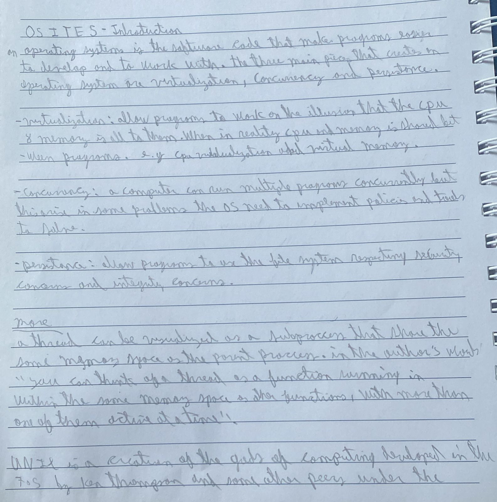
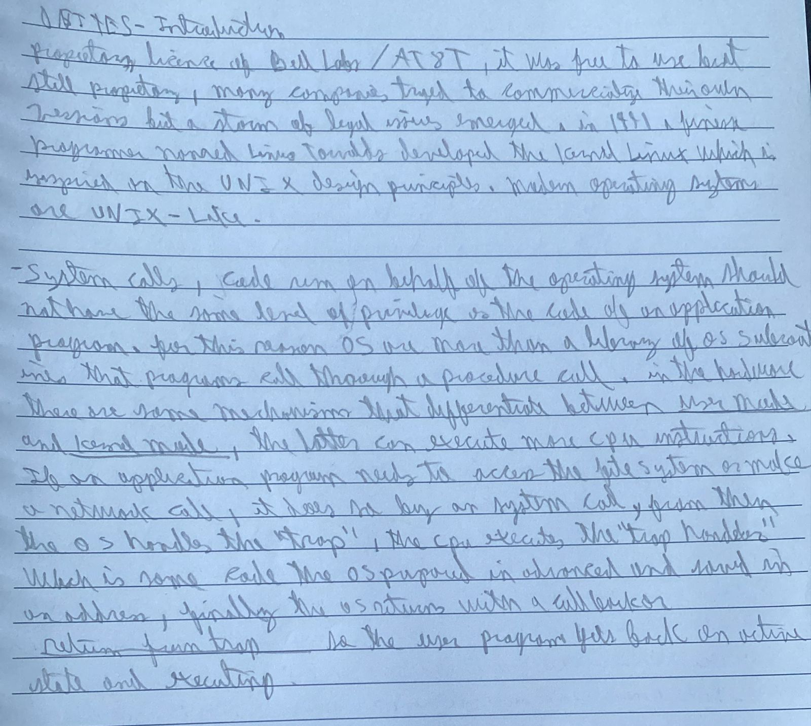
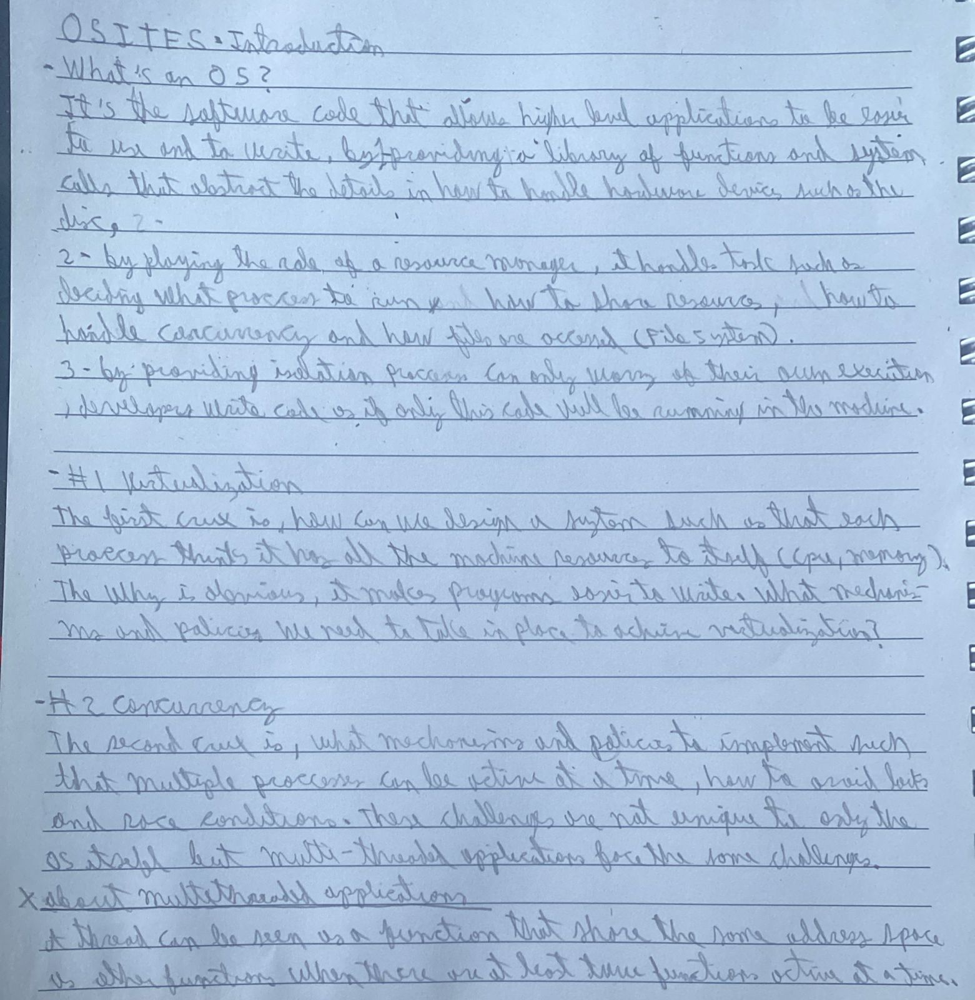
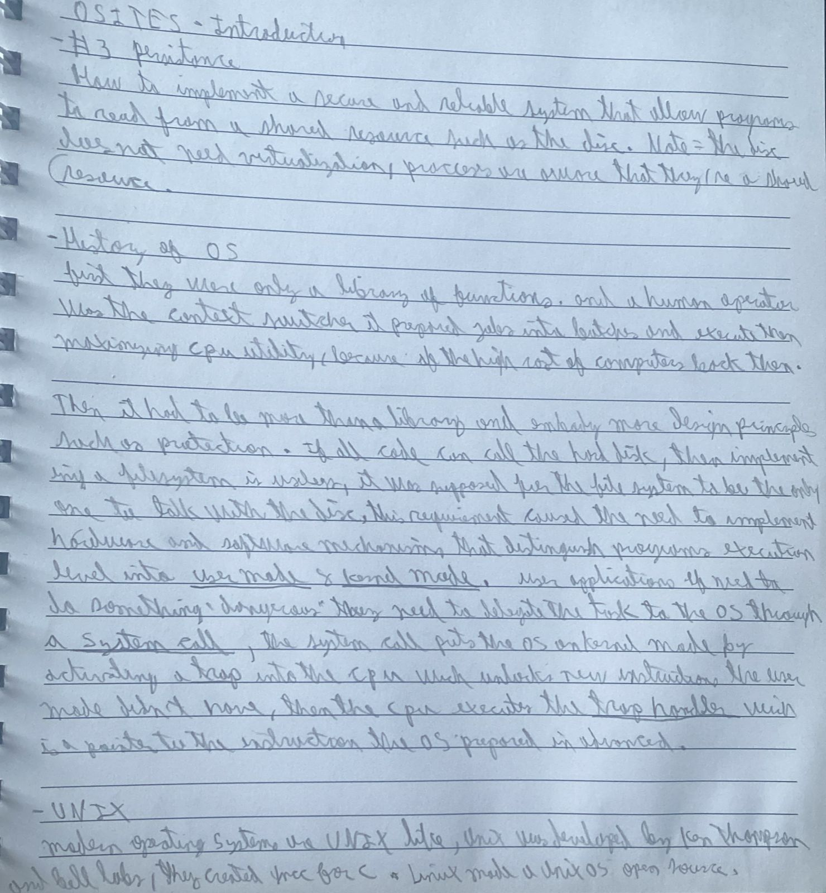

There are three problems OS need to solve.

# The Big threes

## Virtualization
One central question we will answer in this book is quite simple: how
does the operating system virtualize resources? This is the crux of our
problem. Why the OS does this is not the main question, as the answer
should be obvious: it makes the system easier to use. Thus, we focus on
the how: what mechanisms and policies are implemented by the OS to
attain virtualization? How does the OS do so efficiently? What hardware
support is needed?
d
## Concurrency
When there are many concurrently executing threads within the same memory space, how can we build a correctly working program? What primitives are needed from the OS? what mechanisms should be provided by the hardware? How can we use them to solve the problems of concurrency?

## Persistence
The file system is the part of the OS in charge of managing persitent data. what techniques are needed to do so correctly? What mechanisms and policies are required to do so with high perfomance? How is reliability achieved, in the face of failures in hardware and software?

## DESIGN GOALS
Now that we know our requirements and constraints, we can define or design goals which will then guide the trade-offs of our system.

So now you have some idea of what an OS actually does: it takes physical resources, such as a CPU, memory, or disk, and virtualizes them. It handles tough and tricky issues related to concurrency. And it stores files
persistently, thus making them safe over the long-term. Given that we want to build such a system, we want to have some goals in mind to help focus our design and implementation and make trade-offs as necessary; finding the right set of trade-offs is a key to building systems.
One of the most basic goals is to build up some abstractions in order to make the system convenient and easy to use. Abstractions are fundamental to everything we do in computer science. Abstraction makes it possible to write a large program by dividing it into small and understandable pieces, to write such a program in a high-level language like C without thinking about assembly, to write code in assembly without thinking about logic gates, and to build a processor out of gates without thinking too much about transistors. Abstraction is so fundamental that
sometimes we forget its importance, but we won’t here; thus, in each section, we’ll discuss some of the major abstractions that have developed
over time, giving you a way to think about pieces of the OS.
One goal in designing and implementing an operating system is to
provide high performance; another way to say this is our goal is to minimize the overheads of the OS. Virtualization and making the system easy
to use are well worth it, but not at any cost; thus, we must strive to provide virtualization and other OS features without excessive overheads.

### Goals
- Reduce overheads: time (more instructions), extra space (in memory or disk).
- Protection: between applications.
- Isolation: Processes should be isolated.
- Reliable: The OS can't fail.

## Miscallenous
- A device driver is some code in the operating system that knows how to deal with a specific device.

- UNIX and C were closely shipped and developted together. But UNIX was not written in C, but in Assembly for its first version, then **Dennis Ritchie** Created C around 1972, evolving from B, partly because Unix needed a better systems programming language, and by 1973 UNIX was rewritten in C, which was a huge deal because it made Unix much easier to port to different machines. When organizations and universities received Unix, they often got the OS source code, much of it written in C, plus the C compiler and tools. Unix made C important, and C made Unix portable. C made the Unix more portable, because assembly language instructions are tied to the CPU architecture (PDP-11, x86, ARM), so when unix moved from cpu instruction to a higher level C instruction, you just need to change the C compiler in order to move Unix to a new computer, the source code stayed the same, but the compiled code is different and compiling is the job of the C compiler.

# My takes

