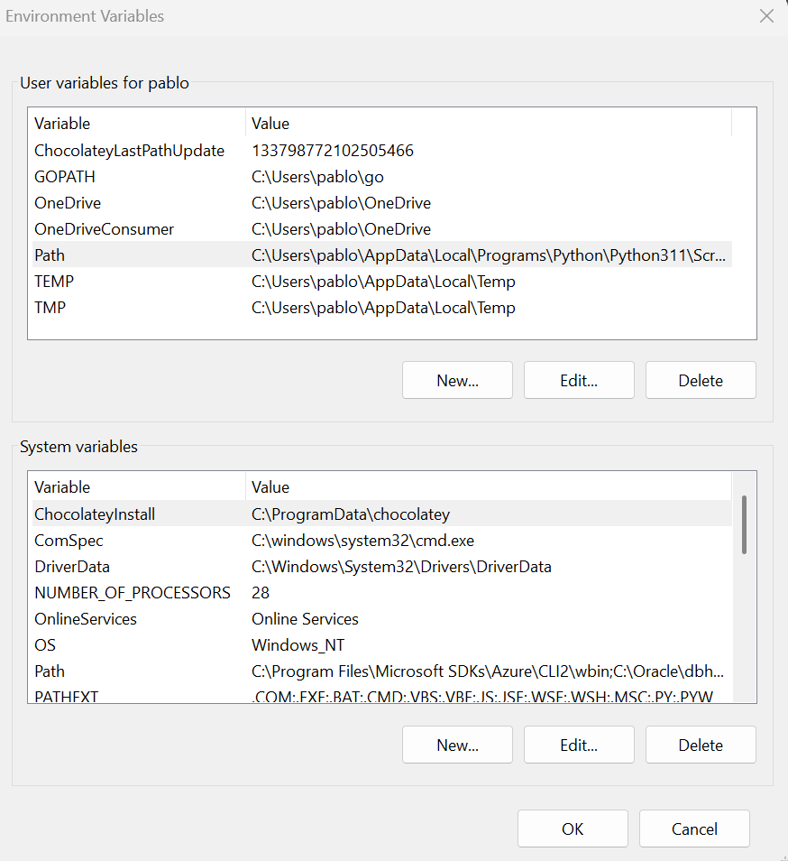
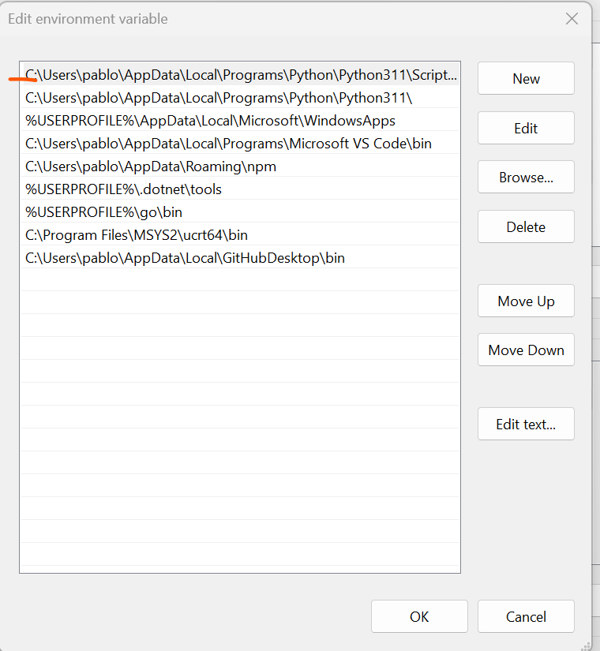

# Environment Variables and the PATH

Environment variables are variables available to processes inside an environment. In Windows, there exist the distinction between **User Variables** and **System Variables**. User variables are available to processes started by a specific user, while system variables are available to processes started by any user on the machine.

Remind you, that a process is the operating system abstraction of a running program. This abstraction is necessary because the OS runs multiple programs concurrently, and it needs to keep track of the execution state of each one independently.

A process contains information such as:

* PID: Process ID.
* Registers.
* Program Counter (Instruction Pointer).
* Virtual Address Space:

  * Code (Text Segment): The executable machine instructions loaded from the application.
  * Heap: A memory region reserved for dynamically allocated data. On most modern systems, it grows upwards.
  * Stack: Memory region used for stack frames, function calls and local variables. On most modern systems, it grows downwards.
  * Static / Global Data.
* Process State.
* Open file descriptors / handles.
* Current working directory.
* Command line arguments.
* Environment Variables.
* ...

When the OS creates a new process, it also creates an **environment block**, which is simply a list of environment variables available to that process. Usually, this environment block is inherited from the parent process.

The process then knows where to find these environment variables.

Example on how to read environment variables:

```c
#include <stdio.h>

int main(int argc, char* argv[], char* envp[])
{
    int i = 0;

    while (envp[i] != NULL)
    {
        printf("%s\n", envp[i]);
        i++;
    }
}
```

Another common way of reading an environment variable is using `getenv()`.

```c
#include <stdlib.h>
#include <stdio.h>

int main()
{
    printf("%s\n", getenv("PATH"));
}
```

An environment variable is simply a **Key-Value Pair**.



---

# PATH Environment Variable

`PATH` is simply another environment variable.

The key is `PATH`, and the value is a semicolon (Windows) or colon (Linux) separated list of directories that contain executable files.

Shells such as **cmd**, **PowerShell**, **sh** and **bash** read this environment variable whenever they need to locate an executable.

For instance, when I do:

```bash
python program.py
```

the shell first checks if `python` is a built-in command, alias or shell function. If it isn't, it starts searching each directory listed in the `PATH` variable until it finds an executable named `python.exe` (Windows) or `python` (Linux).

Conceptually, it does something similar to:

```text
foreach (directory in PATH)
{
    if (directory/python.exe exists)
    {
        execute it;
        break;
    }
}
```



Once it finds the executable, it eventually performs something similar to:

```c
char* args[] = {"python", "program.py", NULL};

execve("full_python_path", args, envp);
```

The real implementation is more involved, but this is a good mental model.

---

Inside a shell you can also define a new environment variable.

On Windows:

```cmd
SET MY_NAME=PABLO
```

On Linux:

```bash
export MY_NAME=PABLO
```

Processes started by that shell afterwards will inherit this new environment variable.

For example:

```
cmd.exe
│
├── SET MY_NAME=PABLO
│
├── python
│      MY_NAME=PABLO
│
└── git
       MY_NAME=PABLO
```

Notice that if the Python process modifies `MY_NAME`, the parent shell will not see the change, because every process owns its own copy of the environment block.

---

## A Note About `exec()`

The `exec()` family of system calls **does not create a new process**. Instead, it replaces the current program with another one.

Conceptually, the operating system discards almost the entire process memory (code, heap, stack, globals, etc.) and loads the new executable in its place. The process keeps the same PID and most of its OS resources, but it is now executing a completely different program.

A new stack is created for the new program, containing its command-line arguments (`argv`) and its environment variables (`envp`).
