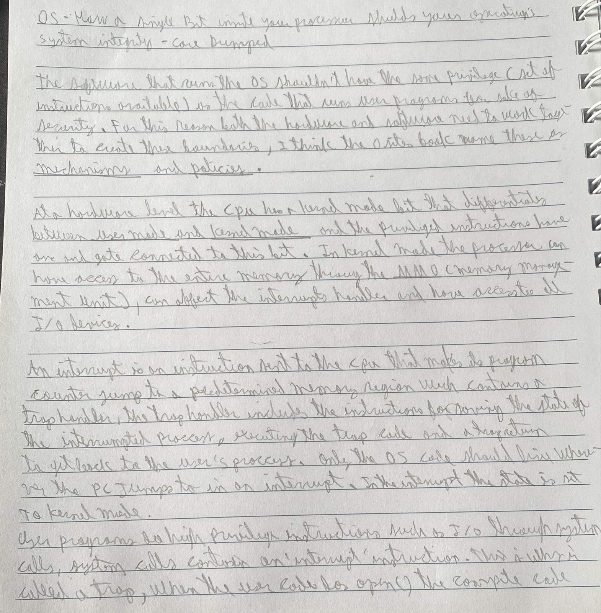
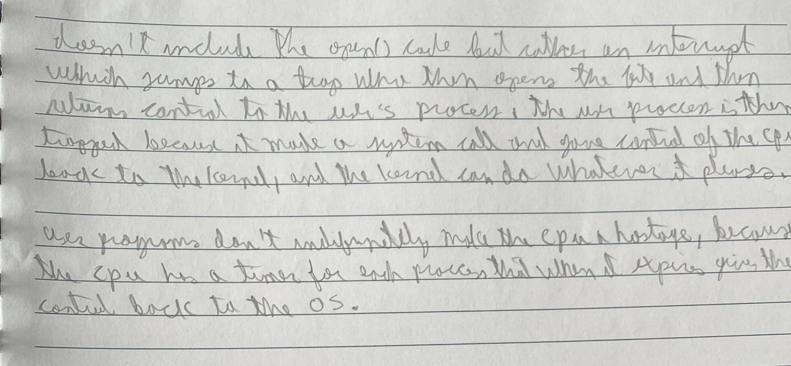

Extra: Drivers, Anti-Cheating software also lives in kernel mode. A faulty drive can throw up an entire system, drivers are neccesary because the OS can't have code for all the hardware devices available.

[video](https://www.youtube.com/watch?v=H4SDPLiUnv4&t=310s)
