# Load Balancer, Container Apps, Container App Environment & VNET Configuration.

In this note, i'll discuss how i implemented containerization with docker to deploy an isolated and protected complete backend application using azure app container and azure app container group, sitting in front of load balancer via Azure Application gateway.

The app container environment, is isolated from the public internet, through a vnet. The load balancer exposes a public endpoint, and has an interface which connects to the app container vnet.

This problem exposes important concepts in cloud containerization services, such as Revisions, Tasks, Networks and Volumes.

## 1. Containarize Apps and Publish to a Registry.
First i downloaded a simple Express Node.js API, which connects to a MongoDB database. Locally it works, through Docker Compose, but docker compose is suited only for development purposes, and not production, later we'll see how the same concepts from compose are used by Azure.

The compose file:
```
version: '3.8'
services:
    mongodb:
        image: 'mongo'
        # this is a named volume, it will persist after the container is # destroyed.
        volumes:
            - data:/data/db
        env_file:
            - ./env/mongo.env
    backend:
        build: ./backend
        ports:
            - '80:80'
        volumes:
            # Bind mount, local changes in the backend folder
            # will be reflected in the /app folder inside the container.
            - ./backend:/app
            # An anonymous volume, it's lifecycle is attached to the
            # container's life cycle. 
            - /app/node_modules
volumes:
    # named volumes are defined here.
    - data
```

We proceed by building the imags, and publishing them to the docker hub repository.

build command:
```
docker build .
```

the tag of the image should be equal to the docker hub repository.
```
docker tag img_id account/repository:version
```

then publish to the registry.
```
docker push account/repository:version
```

If facing docker issues, use:
```
docker builder prune
```

## 2. Create Container Apps, and Container Environment.
When creating the first container app, we need to also create a new container app environment. This environment groups one or more containers into the same container networks, they can also access the same volumes and so on. so these containers can reach other via their internal ips/domains. In comparison, docker-compose already places all services inside the same virtual network, and can access the same named volumes.


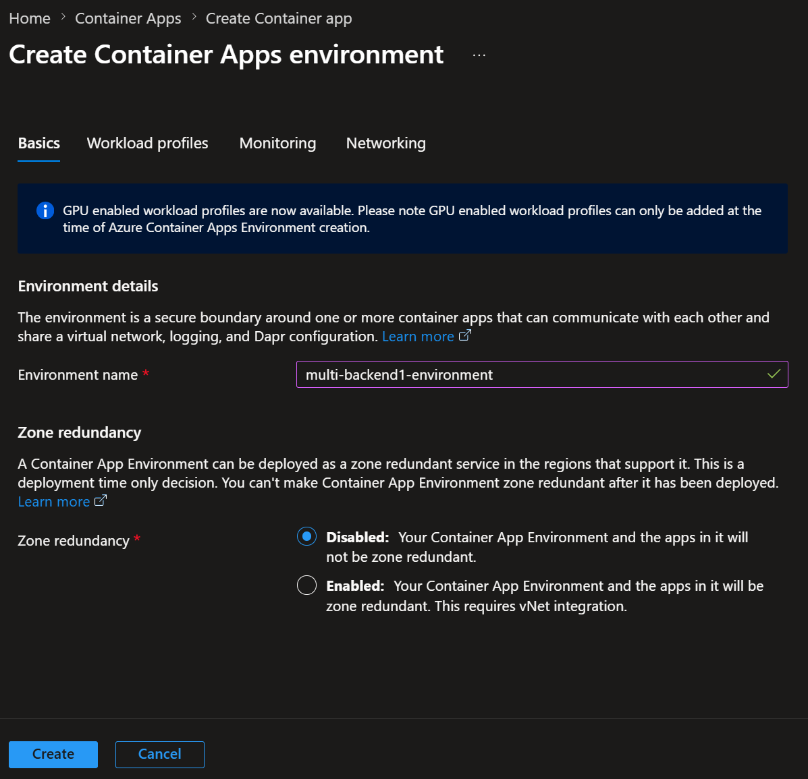


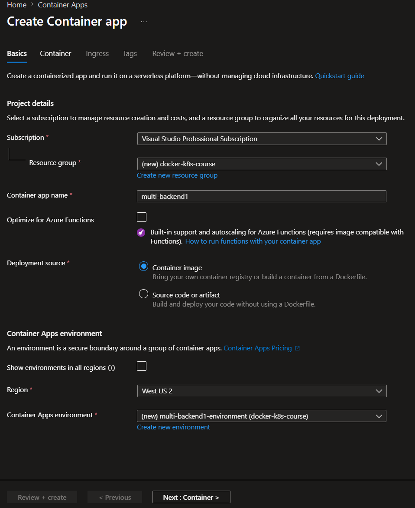

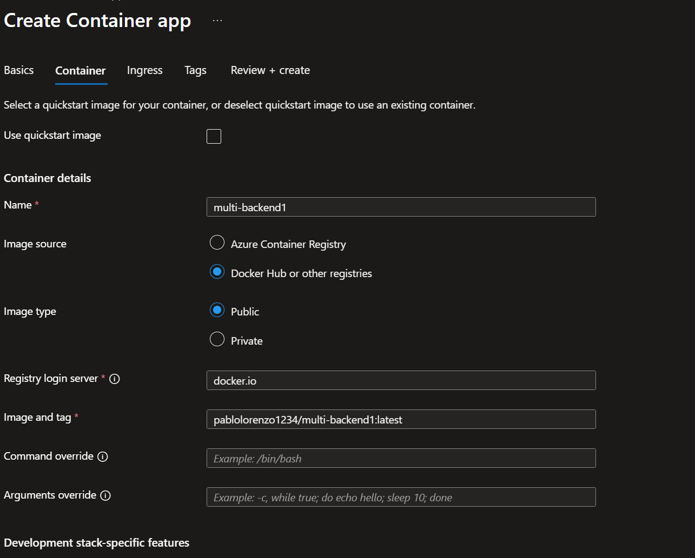

In ingress rules, make sure to make the api accept traffic from anywhere, this way other applications in the same vnet can reach this container app. specially the loadbalancer.
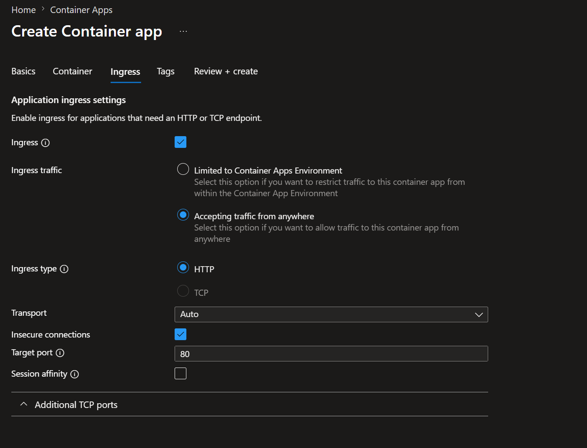

Review of the Api App Container Configuration:
| Setting                        | Value                                    |
| ------------------------------ | ---------------------------------------- |
| **Subscription**               | Visual Studio Professional Subscription  |
| **Resource Group**             | `docker-k8s-course`                      |
| **Container App Name**         | `multi-backend1`                         |
| **Resource Type**              | Container Apps Environment (New)         |
| **Region**                     | `westus2`                                |
| **Container Apps Environment** | `multi-backend1-environment`             |
| **Log Analytics Workspace**    | `workspacedockerk8scourse897c` (New)     |
| **Virtual Network**            | Default                                  |
| **Zone Redundancy**            | Disabled                                 |
| **Container Name**             | `multi-backend1`                         |
| **Image Source**               | Public                                   |
| **Registry Login Server**      | `docker.io`                              |
| **Image & Tag**                | `pablolorenzo1234/multi-backend1:latest` |
| **Command**                    | *(Not specified)*                        |
| **Arguments**                  | *(Not specified)*                        |
| **Workload Profile Type**      | Consumption                              |
| **CPU Cores**                  | 0.5 vCPU                                 |
| **Memory**                     | 1 GiB                                    |
| **Ingress Traffic**            | Accepting traffic from anywhere          |
| **Ingress Type**               | HTTP                                     |
| **Transport**                  | Auto                                     |
| **Insecure Connections**       | Allowed                                  |
| **Target Port**                | 80                                       |

We need to configure an upload a new revision, a revision is simply a snapshot of the container app, you can have more than one revision active at a time, and you can load balance traffic to these revisions. Replicas are just copies of a revision.

First update the environment variables, these are needed to connect to the mongodb database.
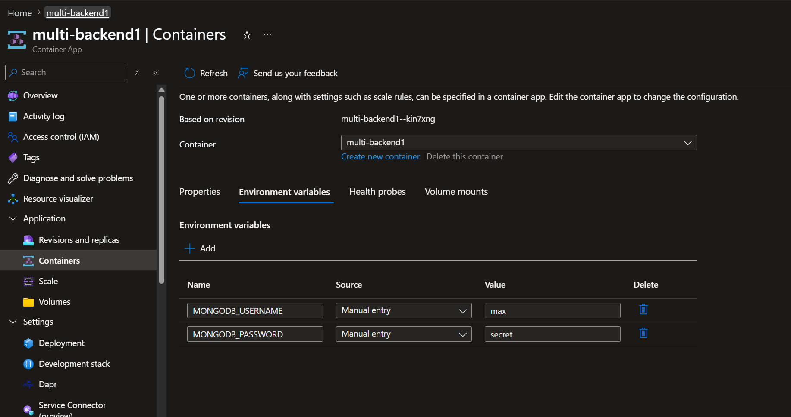

Also configure the health probes.
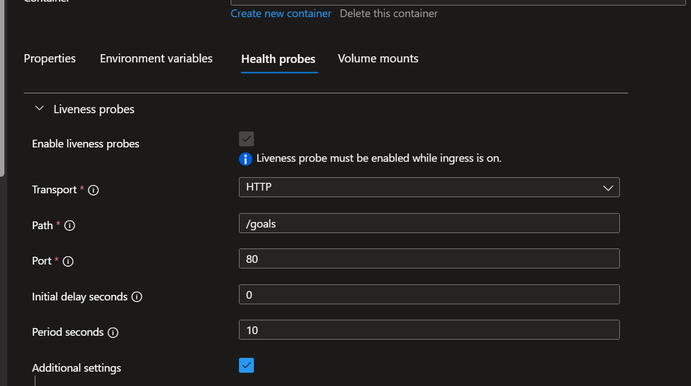

## 3. Create the MongoDB Container App.
I had trouble using the base mongodb image, because the target OS/ARCH is different from the azure runtime environment, make sure that the OS/ARCH image you're using for your container is compatible with your runtime environment.

[MongoDB repository](https://hub.docker.com/_/mongo/tags?page=2)

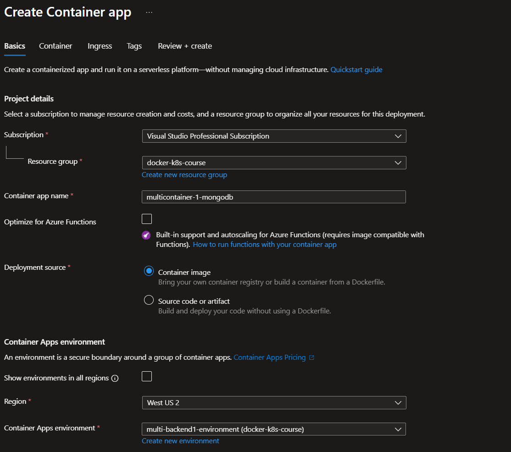

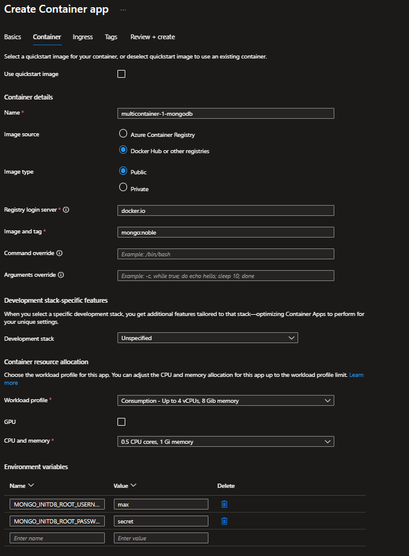

Make sure, that the ingress traffic is limited to the container app environment, so only the API can access it.
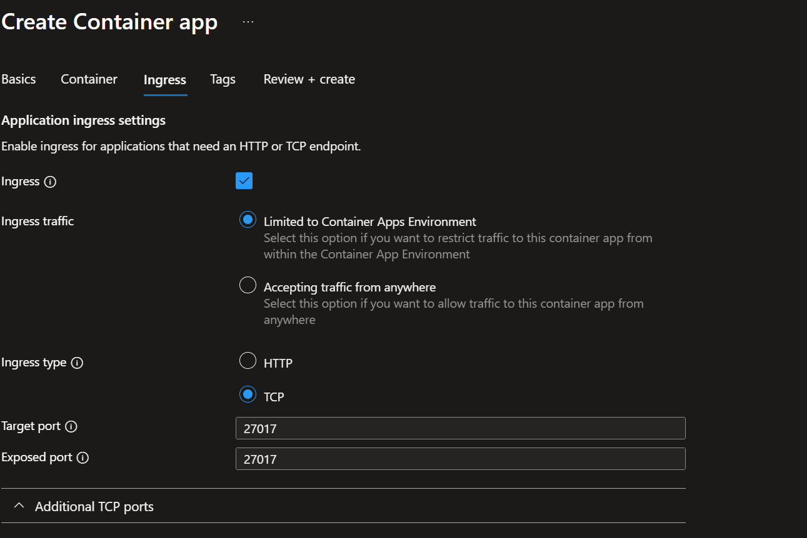

Details:
| Setting                        | Value                                   |
| ------------------------------ | --------------------------------------- |
| **Subscription**               | Visual Studio Professional Subscription |
| **Resource Group**             | `docker-k8s-course`                     |
| **Container App Name**         | `multicontainer-1-mongodb`              |
| **Resource Type**              | Container App                           |
| **Region**                     | `westus2`                               |
| **Container Apps Environment** | `multi-backend1-environment`            |
| **Container Name**             | `multicontainer-1-mongodb`              |
| **Image Source**               | Public                                  |
| **Registry Login Server**      | `docker.io`                             |
| **Image & Tag**                | `mongo:noble`                           |
| **Command**                    | *(Not specified)*                       |
| **Arguments**                  | *(Not specified)*                       |
| **Workload Profile Type**      | Consumption                             |
| **CPU Cores**                  | 0.5 vCPU                                |
| **Memory**                     | 1 GiB                                   |
| **Ingress Scope**              | Limited to Container Apps Environment   |
| **Ingress Type**               | TCP                                     |
| **Target Port**                | 27017                                   |
| **Exposed Port**               | 27017                                   |

## 4. Connect Api to Database
Remind you, that in local development with docker compose, services can reach each other by using the service name as hostname.
ex:
```
# docker-compose.yml
services:
    api:
        image: api
    db:
        image: mongo
```

api can connect to db via connectionstring:mongo:port.

First i need to update the image of the api, to allow for variable mongodb hostname configuration via environment variables. Update the code, rebuild the image with a new tag, and push it to the registry.

Then pick the endpoint for mongodb in /networking/ingress.
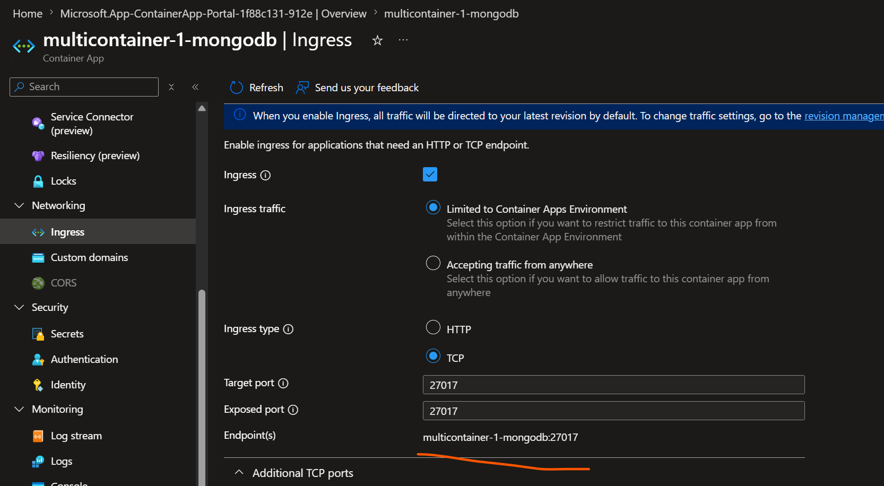

mine is: multicontainer-1-mongodb:27017

Create a new revision of the api app container, with the new environment variable.
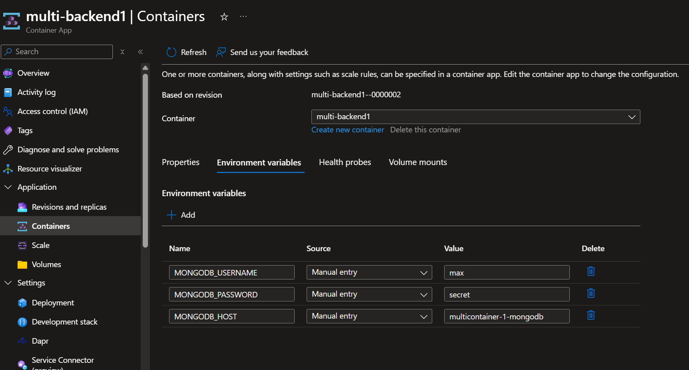

## 5. Mistake
We forgot to add the environment to a vnet, let's do it all again.

### VNET AND APP CONTAINER ENVIRONMENT CONFIGURATION.
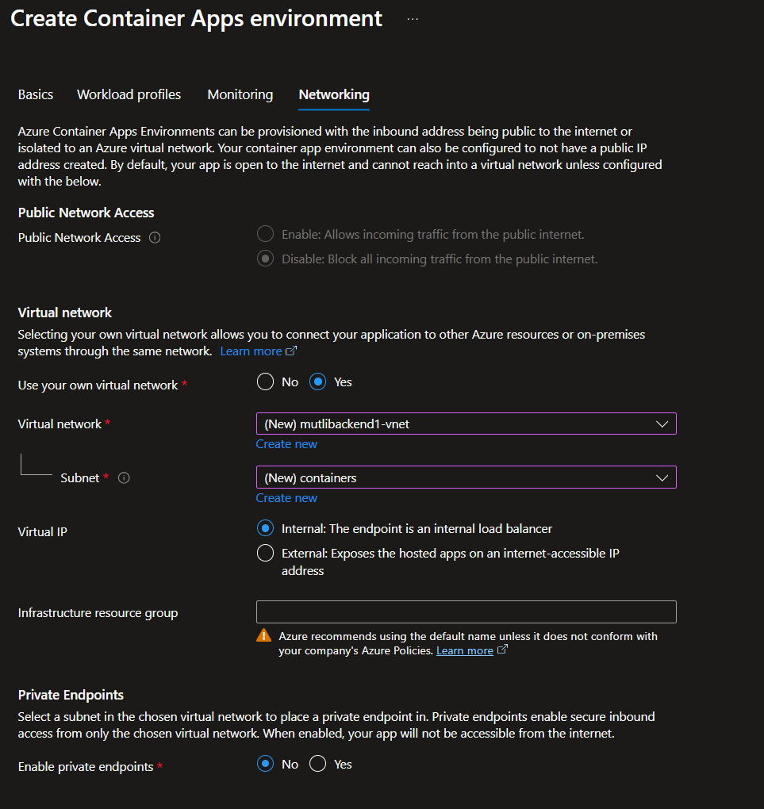

There are a few things going on here:
1 - Public Access Network Access: just disable it, internet should reach the containers inside this environment via a load balancer (application gateway).

2 - Virtual Network
Yes, create one, in this virtual network we'll have subnets, one for our container apps, and another for our load balancer. By default in azure VNETS, all subnets can communicate witch each other, we don't need to spin up a router and configure a routing table nothing of that sort. So our loadbalancer and app container environment, can communicate with each other by default even if they're from different subnets, as long as they're in the same vnet they can reach each other.

Virtual Ip.
- Internal: this will create a load balancer inside the subnet which is only accessible by traffic inside the VNET. Choosing this forces Public Network Access to Disabled.
- External:
    - When public access network is enabled, the VIP will have a public ip address not accesible to everyone, this trick helps with DNS resolution, authorized ips can resolve the container app hostname to a public ip address and reach it. Use cases: Azure Front Door or Application Gateway -> App Container Environment. Keeps DNS resolution simple. Use this if you want a simple setup, where only certain proxies can access the public ip, and when the containers need to access services inside the vnet.
    - When public access network is enabled, the VIP will have a public ip address reachable by anyone - no firewall here.

I will go for Internal here, because i want the application gateway (load balancer) to reach it via is private interface, but it will have to do it through ip, hostname resolution will not be provided for us by default here.

About Private Endpoints.
Private endpoints is a NIC inside the subnet from which you can contact the container app environment, so the container app environment doesn't have a discoverable ip accessible to all subnets in the vnet. Remind you that another way around this, is to place a network security group on the VNET to restrict traffic to the containers subnet inside the vnet, but this is just a firewall, the service is still topologically reachable but no logically reachable. Private endpoints make the environment be topologically unreachable inside the vnet by default.

## API Container & Mongo Container
Make sure that in the ingress configuration, the traffic is limited to the VNET, this way the load balancer can access it, for the API container.
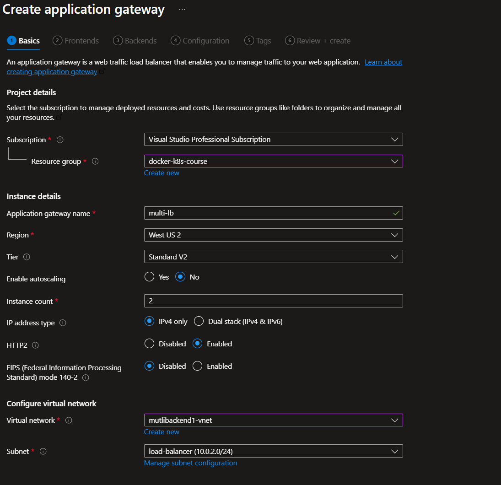

And make sure that for mongo the traffic is limited to only the app container environment.

I also added a /health endpoint to the api, and updated the health probes configuration to hit this endpoint. This way the container app don't think that my container is unhealthy.

I had a lot of trouble spinning up the API container again, and it seems that the culprit was that the environment could not pull from the registry, because the app container is in a VNET. To solve this i added a Nat Gateway to the subnet in where the app container environment is.


## 6. Load Balancer (Application Gateway).


A vnet is mandatory here.

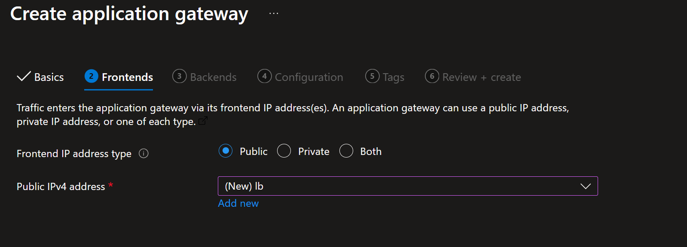

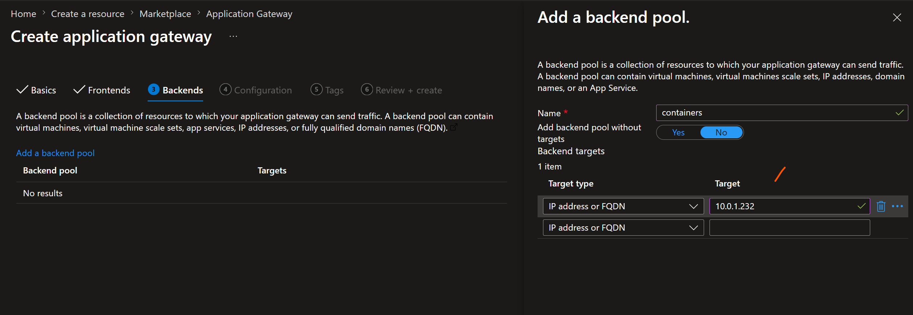
Here add ip of the app container environment.

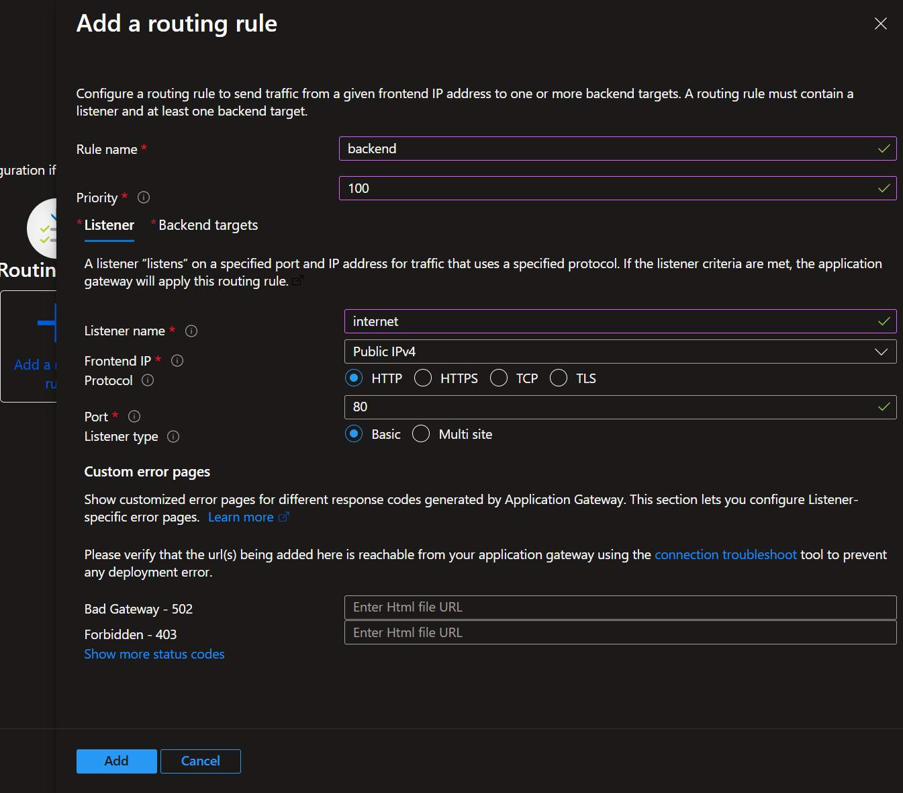

make sure to add this setting to the backend pool.
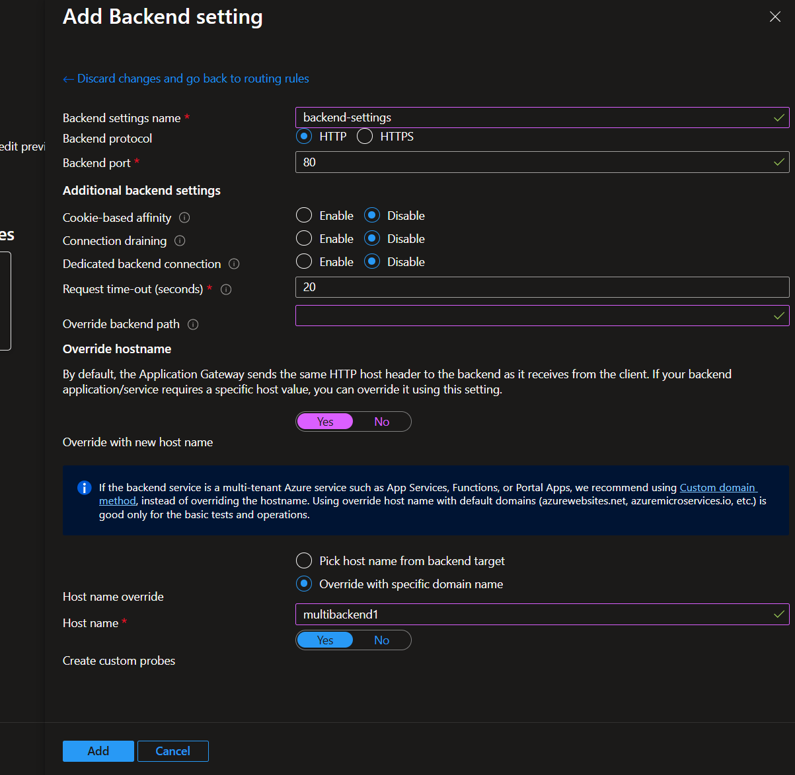

Configure the health probe correctly.
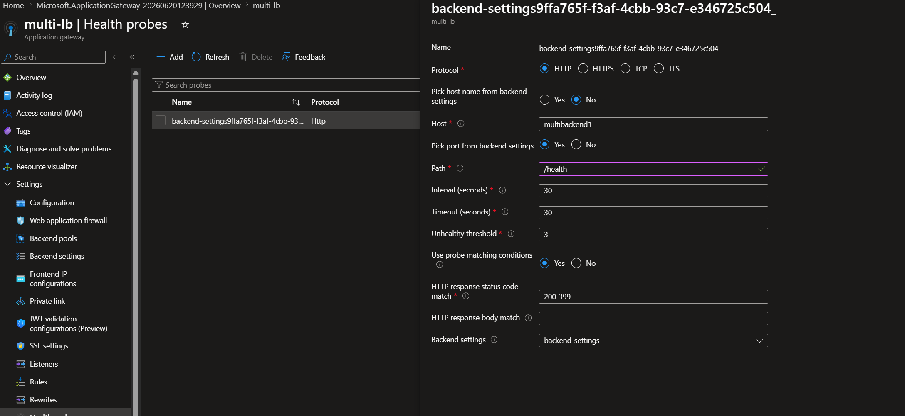


## Other notes
The container apps, when not publicly accesible they won't have ip addresses, in order to access them, you need to do it through the app container environment loadbalancer, and add the container's app endpoint as the host request header. Make sure to apply this configuration in the backend pool, and health probes.

FQND stands for, Fully Qualified Domain Name.

## Conclusion
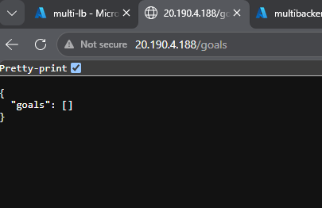
Everything worked.

What we can work on:
- Adding a private DNS, so the app container environment can be accesed through a hostname instead of an Ip.
For this creatie a private DNS zone - remind you a zone is simply the a group of subdomains for domain.
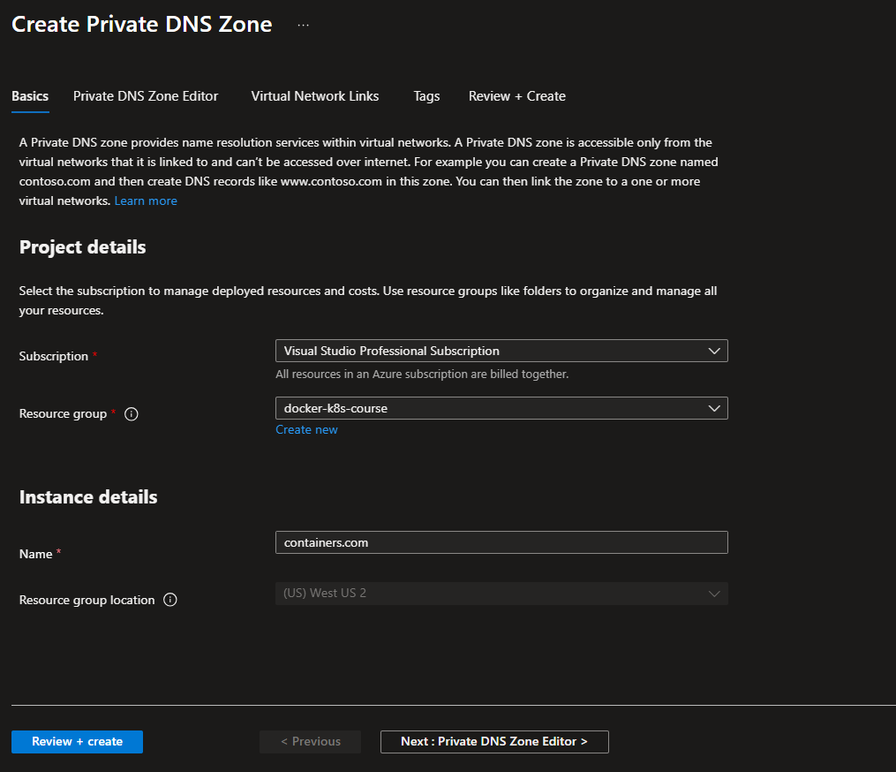

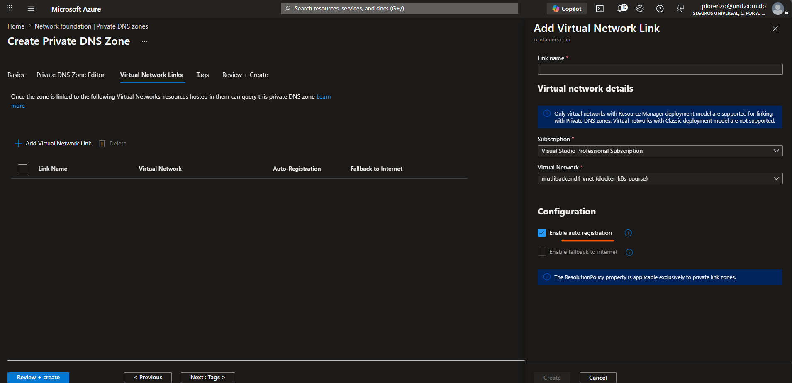
Auto registration, will add a dns record for new resources inside the vnet.

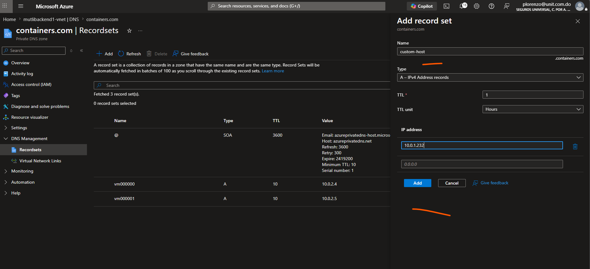

Now let's update the backend pool.
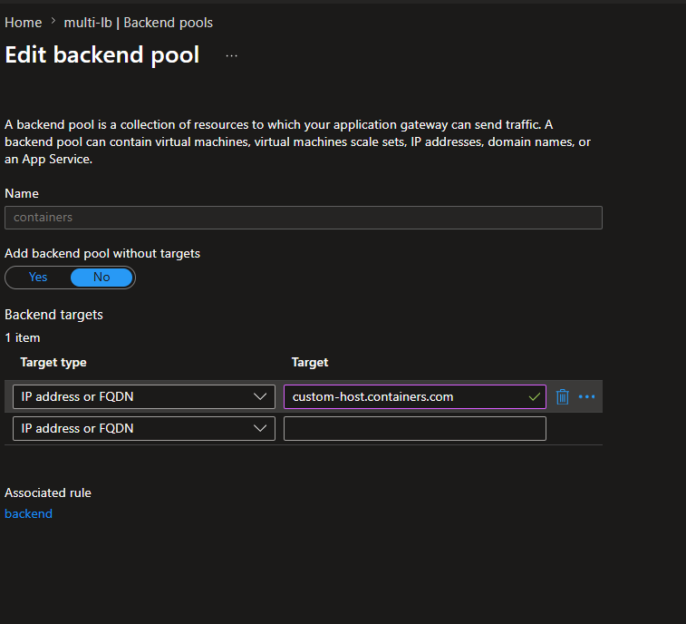

And it worked.

Another thing we can do is add a volume to our database container, so data persists even after the container/replica lifetime.

## Architecture
Internet
    |
Application Gateway
    |
VNet
├── App Gateway Subnet
└── Container Apps Subnet
        ├── API Container
        └── MongoDB Container

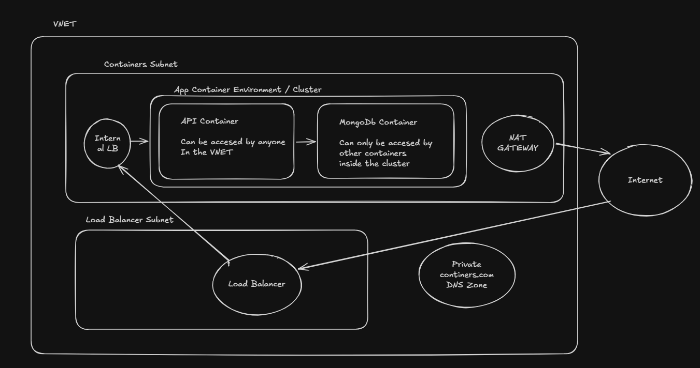

## AWS Equivalents
| Azure                                 | AWS Equivalent                |
| ------------------------------------- | ----------------------------- |
| Azure Container Apps                  | AWS ECS (Fargate launch type) |
| Container Apps Environment            | ECS Cluster                   |
| Revision                              | ECS Task Definition Revision  |
| Replica                               | ECS Task                      |
| Container Registry (Docker Hub / ACR) | Amazon ECR                    |
| Virtual Network (VNet)                | Amazon VPC                    |
| Subnet                                | VPC Subnet                    |
| NAT Gateway                           | AWS NAT Gateway               |
| Network Security Group (NSG)          | Security Group                |
| Application Gateway                   | Application Load Balancer     |
| Health Probe                          | Target Group Health Check     |
| Private DNS Zone                      | Route 53 Private Hosted Zone  |
| Private Endpoint                      | AWS PrivateLink               |
| Log Analytics Workspace               | CloudWatch Logs               |


Internet
    |
Application Load Balancer
    |
VPC
├── Public Subnet
│     └── ALB
│
└── Private Subnet
      ├── ECS Task (API)
      └── ECS Task (MongoDB)
            |
         NAT Gateway
            |
         Internet