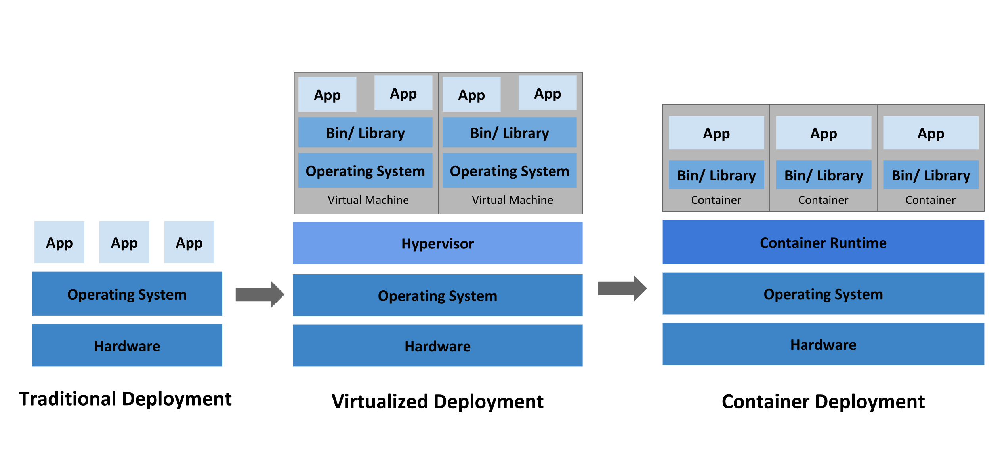
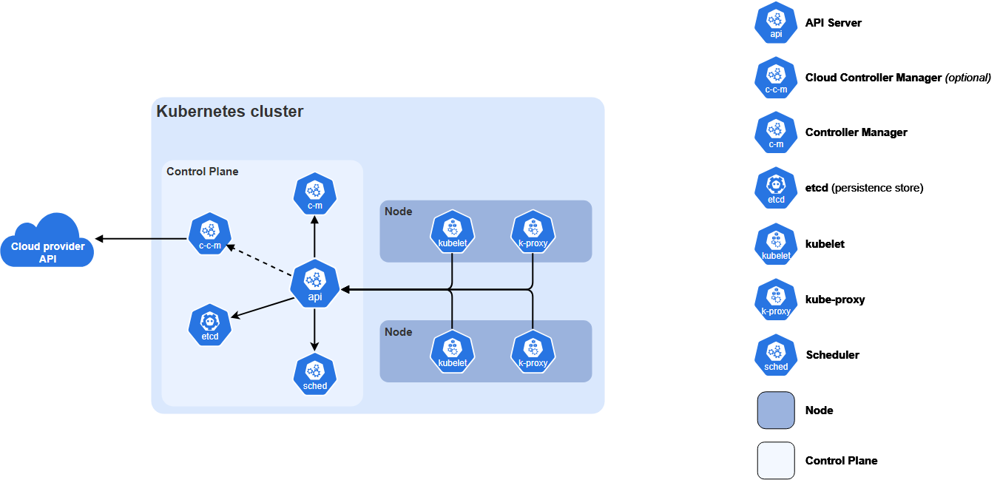

# Kubernetes
It's a open project, that consists on a set of software and hardwared components aimed to orchestrate, automate and agilize horizontally scalable distributed containarized systems.

Or as chatgpt defines it:
Kubernetes is an open-source container orchestration platform. It consists of a collection of software components that work together to deploy, schedule, monitor, scale and manage distributed containerized applications across a cluster of machines.

## Why is it used
To understand why we would use kubernetes in the first place, we need to understand how the world was before Kubernetes, we'll do this by exploring the evolution of a system.



A system usually starts as a monolith, meaning we only have a codebase, and one or a few servers placed behind a load balancer or application gateway.

As the system grows, we may need to split the monolith services into different codebases and therefore different programs or more precisely ```processes``` which may live in the same machine, or in different machines and which in any case these processes need to communicate over a network because they're dependent. This separation allows each service to be deployed as one or more independent processes, allowing each service to scale independently. Resulting in a better usage of the compute resources compared to having all services in the same process, in this latter case all services scale together and linearly.

For example, an Ecommerce site, may start by being a monolith, the process running the monolotih code has many responsabilities defined in services, such as User Management, Recommendation Service, Administration Service, Marketplace service, and so on, if the current resources are not enough for handling the marketplace service because of a traffic spike, if we vertically scale the process (increase cpu, ram) all services are now more load tolerable, but this increase in compute resource is evenly distributed between the services, so some services may end up over scaled and others underscaled therefore resulting in a not so efficient usage of resources and in many cases a more expensive system - compute is not free.

Note: Linux cgroups allow the operating system to control how much CPU, memory and other resources a process may consume. By adjusting these limits we can increase or decrease the resources available to a process without changing the underlying hardware, virtual machines compute configuration also work here. If this is not enough then we can increase hardware capacity. Finally, to not cause confusion microservices processes can live in the same machine, or in different machines. 

So, systems with this scale, such as Netflix, Uber, Facebook, etc. Started separating their services into different processes, because these processes are not completely indepedent, meaning some may need a service provided by another service, for example, the catalog service may depend on the database or recommendation system, these processes need to be able communicate with each other. Processes typically communicate through IPC mechanisms when on the same machine, and through the network when running on different machines. Modern distributed applications generally abstract both behind sockets or RPC frameworks. This design is called a ```Microservice Architecture```.

Note: Procceses are not aware, if the other process they need to communicate to are in another machine or in the same machine, as they all communicate behind the ```socket``` abstraction, from the application's perspective, communication happens through the socket API, regardless of whether the destination process is running locally or on another machine.

With microservices, some problems arose, such as process isolation, developers want their code to work the same not matter where they're running, for this it would be convenient if somehow we can package everything our code/process need to run into something tangible, and that don't matter where this thing run it will run the same. This is how containarization emerged, containarization can be natively implemented by using linux namespaces and cgroups, the former isolate processes, and the latter compute resources this with the help of the kernel. see a namespace as a C# namespace, elements inside a namespace can only see other elements inside their namespace, in case of the processes processes can only see processes inside the namespace, the ips are only relevant within a namespace, file system, ports and so on, so one process inside a namespace, doesn't know anything that's outside of it. Tools were made to facilitate containarization, the most popular and widely used one is **DOCKER**.

Continuing on with the history, each microservice started being packaged inside a container, this way developers should only care that the machine that will run the container has installed the appropiate container runtime, and that will ensure that their code will run the same in any machine.

So by now, we went from a monolotih, to a containerized microservice architecture. But there's something we yet haven't disccused, and is that vertically scaling has a limit, we may have the most capable computer on the world and that may not be enough to support just a single service, so what developers did was to create replicas of these services, this created some system design challenges such as keeping the services in sync (specially if we're talking about a database), evenly distribute traffic between replicas (Existing load balancers became essential because they could distribute requests among multiple replicas of the same service.), but for simplicity sake let's suppose we only need to create replicas of a process which is stateless (doesn't hold state of any connection, or user, so not matter where a connection end ups, the service handling the connection can fullfill the request, and finally doesn't save any persistent data).

So now that we have, copies of processes / replicas, this system because a ```distributed system```, or more precisely in our case a ```microservice containarized distributed system```.

Let's complicate this a bit further, for now we have assumed that the compute resources for each service is fixed, but most of the time its not, thanks to the evolution of ```cloud computing```, we can now provision a deprovision compute resources on demand leading to better utilization of compute and financial resources. So a service in any moment may have a traffic spike, in which will need more replicas of this service or more compute resources for the existing services, and in other times when traffic is low we may deprovision from these resources. So now, our system architecture is elastic.

This design has challenges, to name a few:
1. Keeping a state of the compute demand and increase/decrease compute resources on response may be unfeasible or inefficient to do manually, we'd like a system that keeps track of this.
2. Processes/Services may crash, and not always be healthy, when these services fail they need to be reboot. It's hard for someone to manually keep track of the health of the services, and apply service restoration policies.
3. When we have replicas of a service, to evenly distribute the traffic can have its challenges.
4. Configuring networks each time a replica is created or a new service is added is a challenge, specially in huge systems.
5. Rolling deployments with zero downtime.
6. Service discovery.
7. Secret and configuration management.
8. Scheduling workloads across machines.
9. Recovering from machine failures.
10. Persistent storage management.
11. Network policy and security.
12. Resource quotas and multi-tenancy.

Google had been operating massive distributed systems for years using an internal platform called Borg. Many of the challenges described above had already been solved internally. Drawing inspiration from Borg and years of production experience, Google engineers released Kubernetes as an open-source project to bring these ideas to everyone.

## Kubernetes Architecture
Up until now, everything we have described requires someone—or some custom automation—to constantly observe the system and react to changes. Kubernetes introduces a different approach. Instead of telling the system how to perform each action, we simply describe the desired state of the system:

I want 5 replicas of this service.
Each replica should have 2 CPUs.
Restart it if it crashes.
Never expose the database to the Internet.

Kubernetes continuously compares the actual state of the cluster against this desired state and performs whatever actions are necessary to make reality match the specification.



I highly recommend reading from the kubernetes documentation.

About orchestration, i've found how Kubernetes define orchestration, as they are not referring to the most usual definition of orchestration which is to explicitely imperative state how something should behave (just like program code), but rather they refer as to imperative state the desired state of the system, and then let the machine and framework do what it sees best to make it a reality. Quoting from their documentation:
```
Kubernetes is not a mere orchestration system. In fact, it eliminates the need for orchestration. The technical definition of orchestration is execution of a defined workflow: first do A, then B, then C. In contrast, Kubernetes comprises a set of independent, composable control processes that continuously drive the current state towards the provided desired state. It shouldn't matter how you get from A to C. Centralized control is also not required. This results in a system that is easier to use and more powerful, robust, resilient, and extensible.
```

[documentation](https://kubernetes.io/docs/concepts/overview/)

### Cluster
It's simply all the physical/virtual machines that are part of the system, each machine is called a "Node", and a the entire group nodes managed by a kubernetes control plane is denoted as a ```Cluster```.

### Worker Node
A worker node is responsible for running application workloads. Rather than receiving a stream of commands from the control plane, a program called kubelet continuously watches the Kubernetes API for Pods assigned to that node. It then creates, monitors and destroys containers as necessary through the container runtime (containerd, CRI-O, etc.).

#### POD
A Pod is the smallest deployable unit in Kubernetes. It represents one or more tightly coupled containers that always run together on the same node and share networking, storage and lifecycle.

Containers inside the same Pod share the same network namespace. They all have the same IP address and can communicate with each other through localhost.

In practice most pods only have one container.

###### Container
The containired process running.

##### kubelet

The kubelet is the agent running on every worker node.

It continuously watches the API Server for Pods assigned to its node and ensures they are running. If a Pod crashes, the kubelet attempts to restore it according to the desired state stored in Kubernetes.

##### Container Runtime

The container runtime is the software responsible for actually creating and running containers. Kubernetes communicates with it through the Container Runtime Interface (CRI). Today, the most common runtime is containerd.

### Control Plane
Previously referred as the master node.

This is the brain, the orchestrator / the control panel its job is to make the desired state a reality through a best effort approach. To achieve these it has the following components:
1 - API Server: Through this interface, the user tells the master node its desired cluster state, Every interaction with the cluster ultimately goes through the API Server, whether from kubectl, Helm, CI/CD pipelines or other Kubernetes components.
2 - etcd (persistent store): it's a database that contains the objects (more on this objects later) the user desires - basically stores the desired state configuration. etcd stores every Kubernetes object, such as Pods, Deployments, Services, Secrets and ConfigMaps. Collectively these objects represent the desired state of the cluster.
3 - Controller Manager: Runs controllers (a control loop that watches the desired state of the cluster through the api server and make changes to move the current state to the desired state )to implement Kubernetes API behavior. Every controller continuously executes a reconciliation loop. It observes the desired state stored in the API Server, compares it with the current state of the cluster, and performs actions until both match.
4 - Scheduler: Looks for Pods not yet bound to a node, and assigns each Pod to a suitable node.
5 - Cloud-controller-Manager (optional): Integrate with the underlying cloud provider.

