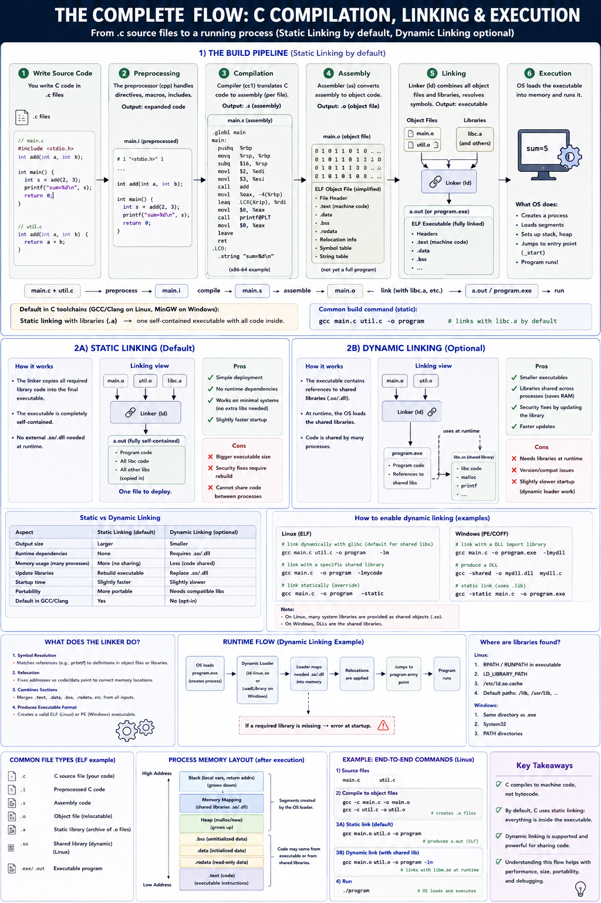
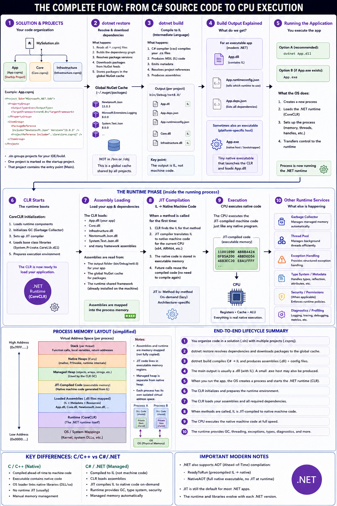

# How Different Programming Languages Execute CPU instructions (REQUIRES REVISION & WORK)
There are various techniques in which programming language source code get finally converted into machine code, we can classify these languages as follows:

1 - Compiled Languages: C, C++, Go.
2 - JIT compiled Languages: C#, Java.
3 - Interpreted Languages: Python, JavaScript, TypeScript.

## How C Compiles


It consists on the following steps:
1 - Preprocessing.
2 - Compilation.
3 - Assembling.
4 - Linking.

### Preprocessing
Extends the ```#include``` headers, is basically pasting what's inside the #include into the .c source code, this results in a .i file.

### Compilation
These .i files, a processed by the compiler, the compiler transform these into .s files (assemblies).

### Assembling
The assembler conver the assemblies files, which consist of assembly source code into .obj file - files containing the binary machine code instructions (cpu specific).

### Linking
Then the linker, resolves declarations, for instance if it sees ```printf()``` it will look in the sdlib obj file for this printf() function, this will happen recursively until we end up with a .exe file in Windows, or an .out file in Linux. Which we then can execute with ./ .

#### STATIC LINKING
This is default, basically all c files and external code binary result is put into the final .exe/.out file.

#### LAZY LOADING
In contrast to static linking, not all the program's code is in the .exe/.out file, but instead at runtime the process may reference a .dll (windows Dynamic Link Library PE) or .so (linux Shared Object ELF), loading the binary code for .dll into the running process memory at runtime.

This results in lighter .exe and .out files, but may reduce application speed.

### PROS & CONS
PROS:
- Host machines dont need a compiler, runtime, virtual machine or any other software to run the program, as the resulting binary machine code is already in an .exe or .out file.

CONS:
- Different operating systems and CPU Isas will requiere different .exe and .out files. which requires installing a different compiler and re-compiling the source code.

- In comparison to JIT compiling, code optimizacion can't be made.

## HOW C# Compiles (JIT)


in C# we have solutions and projects.
- Solutions: this is just an IDE thing, it not neccesary for C# to work, this file just save things like preferences, or starting project. these files are .sln files.

- Projects: these are .csproj files, and they can be seem as an 'assembly', these just contain code. By default, the clr will start running a project.dll at ```Program.cs```, this is the entry point, just like ```main()``` is in C. The .csproj files contain configurations, such as compiling configurations and external libraries references and dependencies.

### DOTNET RESTORE [<PROJECT | SOLUTION | FILE>...] [options]
This command will look into the project/solution or file, and resolve its dependencies, it will download those nuget packages and save them in a global cache.

## DOTNET BUILD
This command will convert the C# source code into Intermediary Language code, saved in DLLS.

Please note: .dll is not something C# specific, it's the dynamic link library windows use to support dynamic linking. But keep in mind, that the C# compiler ROSLYN converts saves Intermediary language into this .dll not native machine code, as would be the case in C.

If you're building a pipeline, and you already did dotnet restore, add --no-restore to the build command, to omit this step.

```
dotnet build
   ↓
MSBuild orchestrates build
   ↓
Roslyn compiles C# → IL
   ↓
Assemblies (.dll) produced
   ↓
OS launches process
   ↓
CLR loads assemblies
   ↓
JIT compiles methods
   ↓
CPU executes native code
```

## DOTNET PUBLISH
Build is more focused for development purposes, while publish is telling dotnet "Prepare my application for execution on a target environment.", it executes this pipeline:

```restore -> build -> publish```

The publish step consist on creating a .exe / .out file which is a native launcher/bootstraper, it's supposed that the host machine have the runtime and .net sdk already installed.

Publish may seem similar to build, but build contains debug artifcasts and build intermediaries not necessarly clean/minimal/deployable code and the output is saved in /debug or /release. in the other hand, publish publishes to publish/.

In [reddit](https://www.reddit.com/r/dotnet/comments/1ifk0nt/dotnet_build_and_dotnet_publish_what_really_is/) someone said:
"
I'm not sure you've received a real, concrete answer yet.

dotnet build compiles the project but doesn't copy dependencies, instead it loads them from the global NuGet cache or installed .NET runtime. So it's not fully independent for deployment.

dotnet publish takes the compiled output and copies all the third-party libraries and project references into the output directory. So the program can run independently without relying on the system's NuGet cache for example.

There are additional options like single-file publishing, trimming, and AOT that can run in dotnet publish but even without those options, the two commands are still different.

The reason dotnet build doesn’t copy dependencies like dotnet publish because it's faster, which is better when you're iterating in development.
"

also read this: https://www.reddit.com/r/dotnet/comments/18zxpsm/difference_between_publish_and_build/?share_id=9TZPj6Y_LOjV-VRqh_5h2&utm_content=1&utm_medium=android_app&utm_name=androidcss&utm_source=share&utm_term=1 

documentation:
- https://learn.microsoft.com/en-us/dotnet/core/tools/dotnet-build
- https://learn.microsoft.com/en-us/dotnet/core/tools/dotnet-publish
