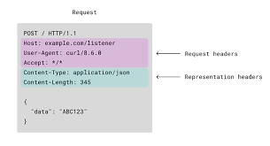
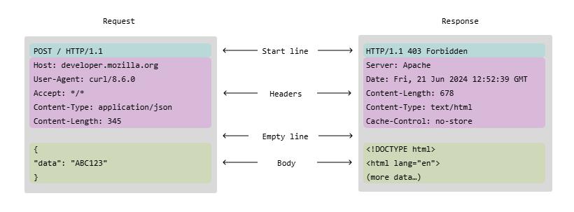

# HTTP & WEB
HTTP is the protocol that gives life to the web. it stands for Hyper Text Transfer Protocol. It's based in a client-server architecture, and uses tcp as its transport protocol, finally this protocol is stateless. This protocol defines how clients (browser) and web servers should communicate, this has had many versions and it's the most widely used protocol in the world.

The interaction consists of client initiatin with an http requests, which contains a request line that specifies the METHOD (GET, HEAD, POST, PUT, DELETE, OPTIONS) uri and http version. Followed by a list of headers, which provide metadata about the content such as (HOST, Content-Type, Preferred-Language, Referer (yes misspelled), etc) and optionally a request body. The server responds with an http response, which contains a response line indicating the http version, status code and status message, followed by headers and optionally a body.

# HTTP 1 & HTTP 1.1
The most used version are http 1 (from the 90s) and HTTP1/1 from the late 90s. The former is non-persitent natively, while the latter is persistent.

# HTTP Request

# HTTP Response


## RTT
In http 1, each request involved a round trip, because http used tcp, messages don't come back as fast, because before exchanging any data a three way handshake has to be done (part of the tcp protocol), and then once the connection is built, the http request is sent, and then the http response is sent, then the connection is closed.

## Non-Persitent Connection
This whole iteration is considered a RTT, and the time it takes is a RTTS. If a client asked for a page, and the server responded with an HTML with multiple `````` tags, then the browser has to make a RTT for each of these images, as you can see this is not efficient. So we conclude that HTTP 1 is non-persitent.

## Persistent Connection
Because of the previos problem http 1.1 was borned, in here subsequent http requests are responded in the same tcp connection. We can see this in action:

client:
````
GET home/index.html HTTP1/1
Connection: keep-alive  -- this header tells the server to keep the tcp connection open.
````

server:
```
HTTP/1.1 200 OK
Connection: keep-alive
Keep-Alive: timeout=5, max=100 -- close after 5 seconds of inactivity or after 100 requests.
```

NOTE: in http1/1 this header is unnecesary, as this behaviro is the default, but if you wanted to make the connection non-persitente, you need to sent ```Connection: close```.

Also, the connection is kept alive not end to end, but just client to the next hop, so if the server is sitting behind a proxy, you will keep the connection open with the proxy, and the proxy - server connectin will handle their connection in their own terms, but if you needed the connection to stay open from end-to-end, just need to include the header = ```upgagred: websocket```.

# Importance of some headers.
- Host: very important for sites that live behind a proxy, for instance a CDN such as cloudflare, everything you ask for there has the destination ip address of 1.1.1.1, but it's the host header cloudflare uses to determine what content you're requesting.
- User-Agent: this request header is useful for web servers, as the can send different content to different browsers - for instance different css stylesheets.
- Content-Type: tells the client and server how to decode the body.
- Accept-Language: is a request header, if the browser have localize content it can send the preferred one.
- Origin: request header, tells the server from what origin was the request from (when the client is a browser).
- Referer: yes it's mispelled, tells the server from what origin the broweser made the request from, important for tracking users, the referer is the whole url including parameters. If you want the server to know about this add rel="noreferrer" to your anchor tags. use rel="noopener" when you dont want the _blank site to control the origin tab via the window.opener api (if you omit this your clients are susceptible to tab hijacking attacks and phising).

# Web Cache and Proxy
In modern network architectures, there's a webcache involved, the webcache job is to reduce network latency and improve user experience, but how does it achieve that? let's understand it by an example. Let's say we have a university LAN network, which has a router with an interface connected to an ISP (Internet), and we have multiple students (browsers) if the students usually fetch the same pages then we might have a bottle neck between the univeristy's lan - router access link (remember when throughput is higher than the transmission rate of the link, a queue is formed an eventually packet loss come), if such thing happens the university will need to buy a higher transmision rate access link which can cost a lot. Also, everyone on the internet will be slowed down, because these students are always accessing the internet, instead of staying in the university LAN. One good aproach would be to spin up a webserver, which cache frequent request made on the internet, and servers them to the clients who asked for them.

The flow would look like this:
when a browser ask for something, the proxy cache will check if it's already cached and not stale, if so return local copy, and avoid touching the internet, otherwise cache will ask for the resource in behalf of the user, cache and then send back the resource to the user.

This happens with CDNs, NGNIX, Azure APIM, etc.

# Cookies
Cookies is a workaround on the fact that http is a stateless protocol, meaning that each request is treated as the first message the server receives from a client, the http message itself should include session information to help the server identify who's it talking to. These are used in many use cases, specially when we want the client to keep a state, such as authentication, a cart in a commerce site, or an identity the server use to track someone.

It goes like this, the server generates a unique string which we call 'cookie', in the http response it adds the header Set-Cookie: cookie;

```
HTTP/1.1 200 OK
Set-Cookie: session_id=abc123
```

Options can be added to this ```Set-Cookie``` response header:
- ;Samesite:
    - Strict: browser will only send this cookie in same-site requests.
    - Lax: Same origin and some top level cross-site navigations.
    - None: allows the cookie to be sent in cross-site requests, but it requires ```Secure```.
    - Domain: control which domain and subdomains can receive the cookie.
    - Path: controls which URL paths receive the cookie.
- ;HttpOnly: if true, javascript code can't read the cookie through the api document.cookie.
- ;Secure: only send the cookie through a https connection.

Browsers, are instructed to save the value of this set-cookie response header in the browser storage. An each time, the browser makes a request to this server it will add this cookie in the cookie request header.

```
GET api.example.com/shopping-cart HTTP/1.1
User-Agent: Chrome
Cookie: auth_code=my-cookie1; cart_id=my-cookie2;
```

Cookies can be used to spy someone's traffic on the web, for instance you visited amazon.com, and amazon sent you a cookie and you saved it, later on you visit facebook marketplace and there happens to be an amazon iframe or image, your browser will then send a request to amazon.com attaching your cookie and adding the referer request header (facebook.com/marketplace/shoes), now amazon knows, user with this cookie is intered in shoes. Next time when you visit amazon, you'll see shoes on the first page, and the advertisements will seem like someone is spying you.

# Conditional GETs
But how does a cache know that its data is not stale? http has some ways around that. The cache can make conditional GETs, in spirit this consist of asking for a resource, and the server will only return the update resource if it has been updated. There are two was.

## Last-Modified and If-Last-Modified.
The cache has nothing so it asks for a resource, and the server response with a header ```Last-Modified: 6th June 2026``` the cache saves the resource, and this response header. later on, when he needs to check if the resource is stale, it will call the server with the request header ```If-Last-Modified``` if the resource was modified after that time, the server will return the updated resource with 200 status code, otherwise it will return a 304 NOT MODIFIED status.

## Etag and If-None-Match
The same idea as before, just that the server sends along with the resource the response header ```etag``` which can be seen as a hash of the body, the cache saves the resource and the etag, and then when it needs to check if the resource is stale it ask with the request header ```If-None-Match``` if the etag has changed it will return a 200 response with the updated resource, otherwise 304 NOT MODIFIED.

# HTTP 2
Used by 40% of clients and servers as of 2020, this provide improvements over the previous versions, such as support for multiplexed request (you can request many things at once, and the frames for each request are sent interleaved, hence there's not HOL block). HOL block is when a giant resource request makes smaller resource request wait, just because it was requested first. Example: you request an html file, which has a video on top of the document a heavy one, and them at the bottom 10, 1mb images, in http 1 the entire video bits had to be sent first, before dealing with the images, developers worked around this by making parallel http requests bus this is not good because now the server has multiple tcp connections for the same client, and a client is eating up way more bandwith.

Http 2 solves this by having multiplexed request, in the same tcp conneciton you can ask for multiple request, and each request response will be server interleaved, first 1 frame for the first request, then 1 frame for the second and so on (concurrrently serverd), now developers dont have to open multiple tcp connections, this is achieved by adding a sublayer in the http protocol which handles this multiplexing aspect. Finally http2 is not text based, but binary encoded, http 1 is literraly ascii text going through the wire, which may be inefficient because of the encoding, decoding + the need of more bits, http2 is binary encoded (just like an ethernet frame) is insteded to be understood by the machine, not a human. You won't notice this last part, as frameworks, and developer tools abstract this away, you will always see the requests as text.

# HTTP 3
This is a draft still, but works on a different transport protocol.
