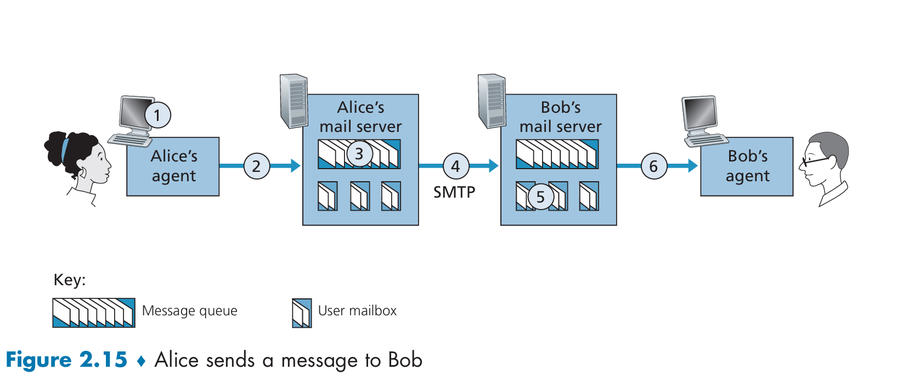
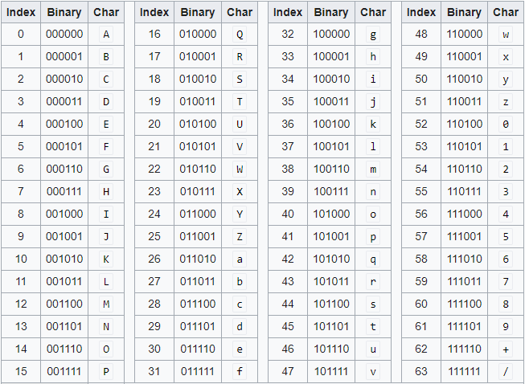
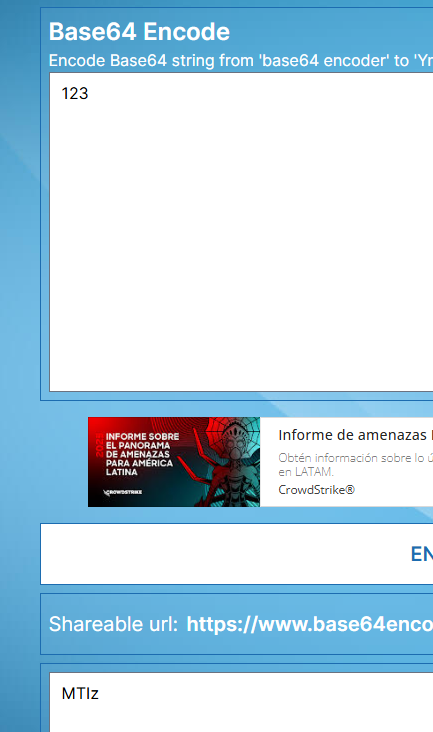

# SMTP & EMAIL
Email is one of the earliest application protocols, it goes back to the 70s with the RFC published in 1982. The application protocol used to deliver email services is SMTP (Simple Mail Transport Protocol), and it consists of the following components:

1 - User Agents (GMAIL, OUTLOOK, YAHOO)
2 - Mail Servers: This has an outgoing message queue, and each client has a mailbox.
3 - SMTP: Protocol Mail Servers use to send emails.
4 - Client Mail Protocol such as HTTP or IMAP (Intenet Mail Access Protocol).

Communication between email servers is done through SMTP, this protocol defines the format of the email. This allow multiple email servers, and email applications to interoperate, a gmail account can send emails to an outlook account, thanks to this protocol.

Email clients, usually make a HTTP rest request to their email servers, and then the email servers themselves communicate through SMTP, then with a client mail protocol (http/imap) a user can see its emails through an user-agent (webapp/application).

## SMTP


This is a simple protocol, it runs on top of the reliable transport protocol TCP. It's ASCII text based, back in the day this design made sense, but today it implies a limitation on sending media attachments because these files now need to be ASCII encoded.

Why do files need to be ASCII encoded?
Because, a protocol such as this depends on standards. For instance as we'll see later there are commands that have meaning such as 'RCPT','HELO', '.', if you happen to just send the bytes of the file through the cable without following the ASCII format, the recipient may bad interpret the message. That's why files need to be ASCII encoded.

### More on ASCII Encoding
How do you ascii encode a file?

There are various ways, but most commonly we use Base64 encoding. In Base64 each position can represent 64 different values (number or letter), this mean that each character encodes log2(64) = 6 bits. so basically from the binary data, you will pick chunks of 6 bits and then encode each of this chunk, the resulting characters is the base64 result.

this implies that:
1 - the encoded result length needs to be multiple of 4, because computers process data at bytes (8 bits), each character is an encoding of 6 bits (therefore 64 possible values), and between 6 and 8 the mcd is 4. so with a digest of length 4 we have 32bits = 3 bytes. So in order to not have padding, the data bytes need to be a multiple of 3.


2 - The size of the encoded data is larger because each 6 bit chunk gets map to a byte, and 8 bits is 33.33% larger than 6 bits.

3 - In case the number of bytes of the file is not a multiple of 3, we need to padd it with 0s bits, and in the encoded result add a '=' per padded byte (maximum we'll have three - ===), this way the decoder knows to not take into account the leading 0s.


example:
the following is 1 byte + 3 bits.
```
01 10 11 01 01 11
```
groups:
```
011011 and 010111 + 000000 (padding) + 000000 (padding)
```
padding was added so the bytes are a multiple of 3.

encoded groups:
```
b X
```
padding isnt encoded, the decoder know its just padding, so it will ignore it.
result: bX==

example:
1 byte + 6 bits
```
01 10 11 01 01 11 01
```

groups:
```

011011 010111 010000 =
```
the last group had to be padded with 0s.

encoded groups:
```
b X Q
```
result: bXQ=

the decoder knows to ignore the leading 0s of the last group because padding = is next.

another example:
binary:
```
10
```

groups:
```
100000 000000 000000 000000
```
we needed to pad the first group, and add another 3 groups of padding.

encoded groups:
```
g
```

result: g===

Then the decoder will do the opposite, map each character to its binary set, but when the encoded result ends with =, it will ignore the leading 0s.

There's also base64url encoding, is the same thing, but the text can be reliably transffered through the web and urls without using any of the web special characters such as ? & = . and /.


## Message format
It's simply text base communication back and forth.

```
S:  220 hamburger.edu
C:  HELO crepes.fr
S:  250 Hello crepes.fr, pleased to meet you
C:  MAIL FROM: <alice@crepes.fr>
S:  250 alice@crepes.fr ... Sender ok
C:  RCPT TO: <bob@hamburger.edu>
S:  250 bob@hamburger.edu ... Recipient ok
C:  DATA
S:  354 Enter mail, end with ”.” on a line by itself
C:  Do you like ketchup?
C:  How about pickles?
C:  .
S:  250 Message accepted for delivery
C:  QUIT
S:  221 hamburger.edu closing connection
```

the message body itself also has a format, where there a required and optional fields. This as specified by the RFC.
```
From: alice@crepes.fr
To: bob@hamburger.edu
Subject: Searching for the meaning of life.
```

## The flow
Alice from its user-agent (web app / application) composes and email and post it to its mail server which will have an interface for handling the client mail protocol used by the user agent such as http or IMAP. This email is then saved in the Alice's mailbox, this server is shared there are thousands of mailbox here, the server will put alice's email in an outgoing queue, then it will open a tcp connection to the destination server then throught the SMPT protocol (where the sender acts as the client, and destination server as server) the sender will send all the emails it need to send to the destination server, multiple emails can be sent in the same tcp connection, eventually everything is complete.

Bob will open it's user agent application, fetch its emails and read them when he finds it convenient.
