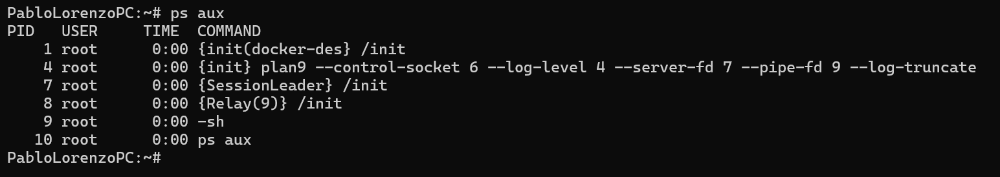
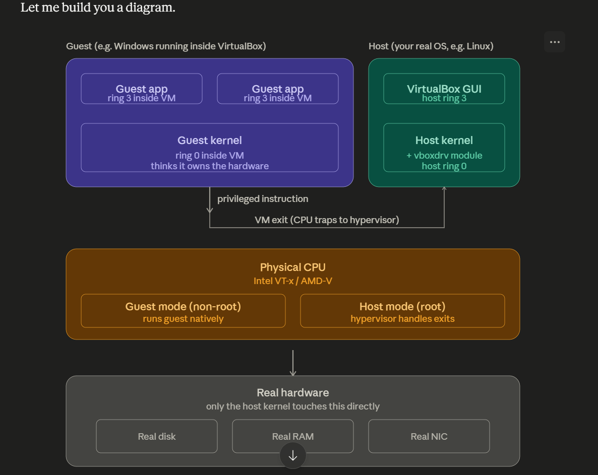
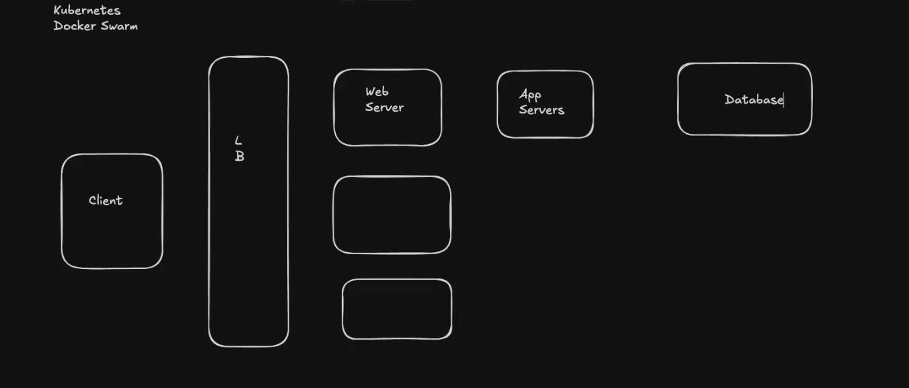
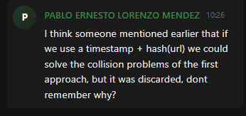

# System Design Fundamentals

## Differeance between Bare Metal, Virtualization and Containers.

### Important Concepts

#### Kernel and User Mode.
Code executed on behalf of an user application program, should not have the same privilige as code executed on behalf of the OS. there are hardware and software level constraints that differentiate both levels of privilige in User and Kernel Mode. In the CPU there's a register flag which differentiate this modes, kernel mode extends the instructions available to be executed by the CPU, critical instructions such as reading from disc or making network calls. For this reason user applications user ```system calls``` such as in linux ```fork()``` to create a process, or ```open()``` to read from a file. The kernel is the abstraction user applications use to access the hardware, the kernel is the orchestrator, it handles resource virtualization (compute and memory), concurrency and file access through a file system.

The kernel is the orchestrator of the machine. It does not just "give access to the hardware" — it provides **abstractions** on top of hardware that user programs rely on: processes and threads (CPU virtualization), virtual memory (memory virtualization), files and sockets (I/O abstractions), and the synchronization primitives needed to manage concurrency safely.

#### Difference between Kernel & OS.
The Kernel is the software code that makes user applications easier to work with and to develop and also provides, it offers a library of functions (system calls) for programs to use, so they don't need to worry about the hardware details e.g such as how to handle the disc reader, the kernel has a read() system call the applications use to read a file, then it's the kernel job to read the disc, the user application doesn't worry about the brand or type of disc. the software used to manage a hardware piece is called a driver btw. Also the kernel makes user applications easier to use by providing things such as virtualization (programs believe they have all the cpu and memory to themselves), it also ocherstraste programs meaning manage concurrency allowing multiple programs to run in the machine (just imagine if each user application should care about that!). Finally the kernel is not only a convenience layer it also offers:
- **protection/isolation**: keeping processes from corrupting each other or the system.
- **resource arbitration**: deciding who gets CPU time, memory, I/O bandwitdh.
- **Abstraction**.
Without the kernel, you don't just have a harder programming environment - you have no security boundary at all.

On the other hand the OS sits on top of the kernel (the OS includes the kernel, you can't swap the kernel without affecting the OS), and it provides other functionalities built on top of it such as a shell, system libraries, package managers, tools, etc. e.g windows, windows use the windows NT kernel, the os adds the cmd, the user interface, the control panel and all that stuff. finally Linux is a kernel, not an operating system, for instance Ubuntu is a OS which uses the Linux Kernel.

In short the kernel is like the engine, and the OS is the whole car. the engine is part of the car, not something the car sits on top of.

Your notes are already good conceptually. I mostly tightened the wording, corrected a few inaccuracies, and preserved your explanatory style.

---

#### Processes, Namespaces and Cgroups.

Processes are the abstraction the kernel offers that represent an instance of a running application. A process has components such as:

* an address space (virtual memory),
* the Program Counter (PC), which stores the next instruction to execute,
* a Stack,
* the Code itself,
* Static variables,
* and other CPU registers important to the execution of the process.

The kernel uses this abstraction to run multiple isolated applications concurrently. Isolation is mainly achieved through memory virtualization and CPU scheduling. The process abstraction makes programs easier to develop because it creates the illusion that the entire computer hardware is dedicated to the program itself, even though many processes are running simultaneously.

The Linux kernel also offers powerful isolation and resource management mechanisms such as namespaces and cgroups.

---

#### Namespaces

Namespaces provide isolation to processes.

We can inspect running processes in Linux using commands such as:

```bash id="u0f6g5"
ps aux
```



Here, as the root user, I can see all running processes in the machine. Normally, processes can see metadata about other running processes in the system.

Linux provides different types of namespaces:

* **PID**: isolates process IDs and process trees.
* **NET**: isolates network interfaces, IP addresses, ports, and routing tables.
* **MOUNT**: isolates mounted filesystems.
* **UTS**: isolates hostname and domain name.
* **IPC**: isolates inter-process communication resources.
* **USER**: isolates user and group IDs.

This isolation is provided directly by the kernel itself.

Namespaces allow a process to believe it is running in its own isolated environment. For example:

* inside a PID namespace, the process may think it is PID 1,
* inside a NET namespace, the process may think it has its own network interfaces and ports,
* inside a MOUNT namespace, the process only sees the filesystem mounts available in that namespace.

This is one of the fundamental technologies behind containers such as Docker.

---

### Cgroups

Namespaces provide logical isolation, but cgroups (Control Groups) provide resource control and limitation.

With cgroups, the kernel can limit how many resources a process or group of processes may consume, such as:

* CPU,
* Memory,
* Disk I/O,
* Network bandwidth.

Without cgroups, a process could potentially consume all machine resources and affect the stability of the system.

Containers typically combine:

* namespaces for isolation,
* and cgroups for resource management.


### Bare Metal
Bare metal refers to that, a bare metal machine, with a single hardware, kernel, operating system and applications running on top of it. just like your own laptop.

props:
- If you need something to run fast, use this, e.g Kafka. this choice provides the least latency.

cons:
- If your applications need different environments, you're in a challenge here, you'll need another full bare metal machine. if not relying on virtualization and containerazation.
- Hard to vertically scale and horizontally scale.

### Virtual Machines
A virtual machine is a completely entire machine (virtually, not physically) inside another machine including the Kernel, OS, and applications. for this we need a hypervisor, the hypervisor splits the physical resources of the host machine between the virtual ones. A virtual machine (VM) is a software-emulated computer, each vm think it has its own cpu, ram, disks, network cards, BIOS/UEFI and operating system, but the hypervisor is controlling and sharing the real hardware underneath.

there are different types of virtual machines.

#### Type 1 (Bare Metal).
Runds directly on the hardware, there is no normal host os underneath. its advantages are better perfomance, better isolation, less overhead, enterprise-grade resource control, stronger security boundaries. used heavily in cloud providers, datacenters and enterprise servers e.g AWS, Azure, Google.

#### Type 2 (Hosted).
These are ony used in local, and development settings. it consists on running a software based hypervisor such as OracleVMBOX, here the guest OS sits on top of the host OS. How this is achieved is that some CPUS offer some priviliged level such as HOST MODE and GUEST MODE level, this was done for this kind of use cases. the guest os runs on the guest privilige level, thinking it's running on the most privilige level there is, meanwhile the root os is running on root vm privilige level. When the guest operating system tries to do something outside of its privilige the hypervisor intercepts it and hanldes it.

TODO THIS NOTE AIN'T THAT CLEAR YET.



### Containers
Containers are isolated blundled applications that run on top of the same host OS. each container is indenpendent, this is achieved thanks to Linux Namespaces and Cgroups. these make them easy and quick to spin up and shut down. think of a container as a heavily isolated process environment.

[Great Video on Docker and How it works](https://www.youtube.com/watch?v=DUgzXX2_aDQ&t=224s)
### Docker.
Docker did for containers what VMware did for VMS, it made them asy, portable, reproducible and developer-friendly.

### If docker runs on linux, how does it work on Windows and MAC.
On windows, docker desptop usually runs linux containers inside a lightweight linux virtual machine. the containers are not using the windows kernel. they're using a real linux kernel running in a vm. today docker desktop typically uses Windows Subsystem for Linux 2 (WSL2).

#### Kubernetes.
Orchestrate containers.


## Distributed Systems


Distributed systems components can be classified as Compute, Storage and Networking (Computer Science in short), most cloud providers even divide their services in this categories.

### Computes: Clients, Load Balancers (NGNIX), Web Servers,  App Servers.
Compute refers to anything that does work, such as client applications (browsers, mobile apps).

- load balancers: proxy that sits in front of server, and distributes the traffic between these.
- web server: receives http requests.
- app server: the logic code running (C#, java, python).

## Storage.
Anything used to stored data, sql databases, nosql databases, cache systems, and i think even queues.

## Networking.
VNETS, tables, CNDS, DNS all that stuff.

## Design Bitly (url shortener).

### Functional Requirements (What the user cares).
- Convert urls to shorter urls.
- The shorter urls should redirect to their original longer version url.
- Shortened urls can't be duplicated.

### Non Functional Requirements (engineer requirements).
- low latency
- it should handle heavy reading demands (this a requirement i made myself).
- scalable.

### API DESIGN
- GET domain/shortened-url -> redirect with 302 to the correct url.
- POST -d {"long url": "https://giannis-atentokoumpu.com"} -> returns 200 in case of success, 400 if bad, 409 if conflicts exists.
- DELETE

### Schema/Entity/Table
- URL table, with PK, shortened url, original url, created_at.

### How to create non-duplicate non-deterministic shortened URLS
#### Hashing
Hashing wont' work because it's deterministic. same input same output, and even with different inputs there exists the chances of collisions.

#### hashing (long url + random).
doesn't completely eliminate collisions.

this approach will cause collisions in concurrent approaches.

#### Base 62.
62 possible characters per digit, with 8 spaces we have 62^8 = 200 trillion combinations. collisions are unlikely, but possible.
#### hashing + increment.

#### Chatgpt
Use a distributed unique ID generator, then Base62-encode the ID.
ex:
```
ID: 987654321
Base62: 14q60P
Short URL: https://short.ly/14q60P
```

The short URL does not need to be generated from the long URL.

## Homework
Temporary email service. develop a temporary email service. with the requirements [example](https://temp-mail.org), add the requirement that the address should not look random or timestamped.


## Miscalleneous

### HTTP 301
301 means resource has moved permanently. also the client caches the redirect url.

ex:
(client).

```
curl -i https://google.com.do
---
Location: https://www.google.com.do/
Cache-Control: public, max-age=2592000 (30 days) (public means the response is allowed to be cached by ANY cache: browsers, CDNS, reverse proxies, ISP, etc, private means only the browser caches it).
Expires: Mon, 15 Jun 2026 16:32:26 GMT (expires is used by older browsers.)
```

the browser will follow the location response header.

### HTTP 302
Means resource have moved temporarily. client' won't cache the redirect url. it will always check the latest location.

ex:
(client).

```
curl -i https://tinyurl.com/5edkn5ck
---
location:  https://redirect.viglink.com?u=https%3A%2F%2Fwww.linkedin.com%2Fin%2Fpablo-lorenzo-m%25C3%25A9ndez%2F%3Flocale%3Den&key=a7e37b5f6ff1de9cb410158b1013e54a&prodOvrd=RAC&opt=false
```

### HTTP 409.
The request is valid, but conflicts with existing system state. common in username alreadys exsts or unique constraint violations.
