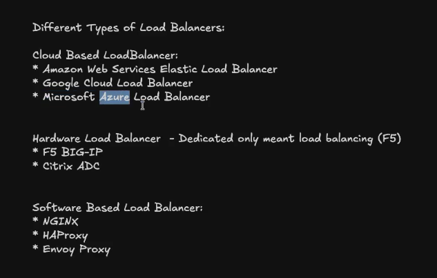
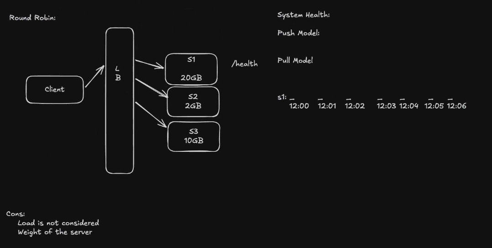

# Differeance between Stateful and Stateless.

# Namespaces

# CGROUPS.

# LOAD BALANCERS

## Types of load Balancers

1 - Cloud Based LoadBalancer

2 - Hardware Load Balancer - Dedicated only meant load balancing (F5).

3 - Software Based Load Balancer: NGINX, HAPROXY, ENVOY PROXY.

## L7 Load Balancers, and L4 Load Balancers.
L4 is used are in websockets.

## Algorithms

### Round Robin

PROS:

CONS:

#### Push Model
#### Pull Model (/health)

### Wegihted Round Robin

PROS:
CONS:

### Least Connection

### Least Response time

### Hashing Based
cons: data movement, when a server fails.

### Consistent Hashing.
cons: possible cascading failure.

### Consisten Hashing v2.

# SSL Termination

## SSL Paththrough.

## What's next
- Consisten Hashing Version, Consisten Hashing Version 2.
- Scalability, Availability, CAP Theorem....
- DropBox/GoogleDrive.
- Slack/Whatsapp/.
- Communications (HTTP, HTTPS, ...)
