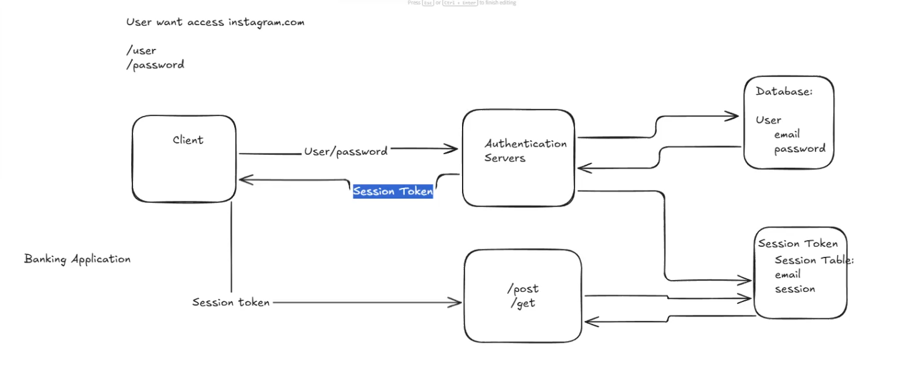
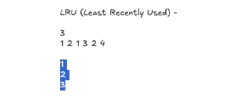

# Authentication

## SSO & SAML

## OAuth 2.0, OpenIdConnect
[OAuth Page](https://oauth.net/2/)
[Udemy Course](https://www.udemy.com/course/oauth-2-simplified/?referralCode=B04F59AED67B8DA74FA7&couponCode=25BBPMXINACTIVE)
[RFC](https://datatracker.ietf.org/doc/html/rfc6749)

### Microservices Authentication

## Session Tokens

# Caching

## Cache Levels

Client -> Loadbalancer -> Server -> REDIS / MEMCACHE -> DATABASE -> OS (L1, L2) -> SSD/HHD.

## Cache Aside / Lazy Initialization
Resource that are first queried are fetched from the database and then saved to the cache, subsequent queries for the same resource will be handled by the cache.

## Write Through Cache
Writes goes to both database and cache, but only the cache will be queried.

## Write Back Cache
Cache is updated first, and then the database is updated later asynchronously. The core idea is to prioritizie write speed by delaying persistence to the database.

## Cache Stampede (Thundering Herd)

### Request Coalescing

## Cache Eviction Policies

### LRU (Least Recently Used) - Always appear in Interviews

We have a cache size of 3. And requests were made for 1 2 1 3 2 4, each one is cached if not already present in the cache.
When the last query comes 4, we will remove from the cache the key 1, because it's the least recentl used.

### LFU (Least Frequently Used) - Always appear in Interviews

Remove the key thas is the least frequently queried.

### FIFO (First in First Out)
Just a queue.