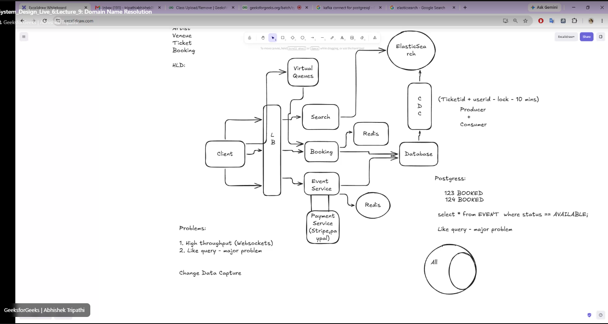

# Ticket Master


## Functional Requirements.
1 - Users can buy tickets for events
2 - User should be able to view the events.
3 - I need to book the tickets for the event.


## Non-Functional Requirements.

## Schemas:
- Event/Show
- Venue
- Artist
- Booking
- Ticket
- User

## API

GET /search: location&datech&query

GET /view/eventId

POST /booking
```
{
    TicketIds
    PaymentDetails
}
```

## Problems
1. Ticket Locking
