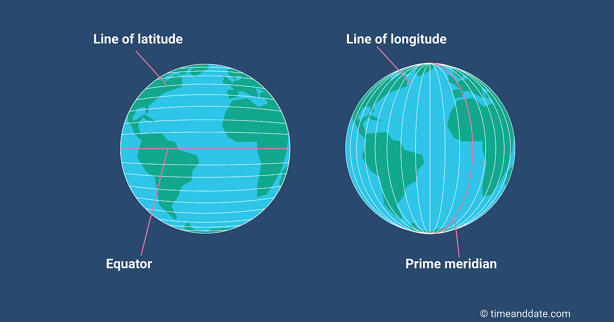
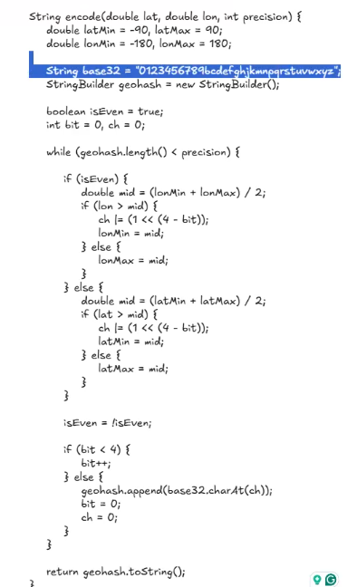

# Indexes

## Geopatial Indexes



### GEOHASH
This allows database queries which use lat/long filters to be faster. Typically with

```SELECT * FROM LOCATIONS WHERE LAT > LAT_QUERY AND LONG < LAT_LONG```
is inefficient, because we're doing a 2d query, while indexes only index one column. If we can encode a location [lat, long] in a 1d way, then we can create a efficient query. This same trick is also used in elasticsearch in where we want to find similar words.


[Video](https://www.youtube.com/watch?v=26dBzTHP2No)
[Great Resource](https://eugene-eeo.github.io/blog/geohashing.html)

#### Python pygeohash
#### REDIS GEOHAS

#### POSTGRES GIS
#### CODE


### QUADTREE
[Article](https://hypersphere.blog/blog/quad-trees/)


### R TREE