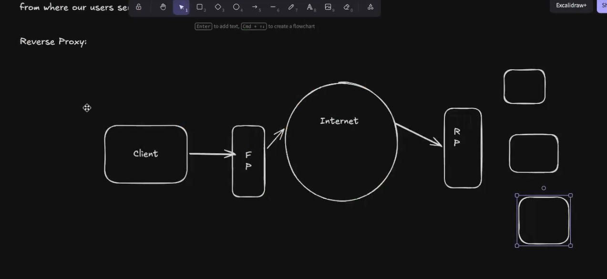
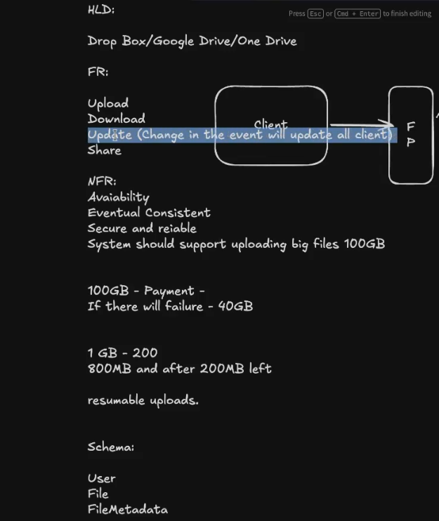
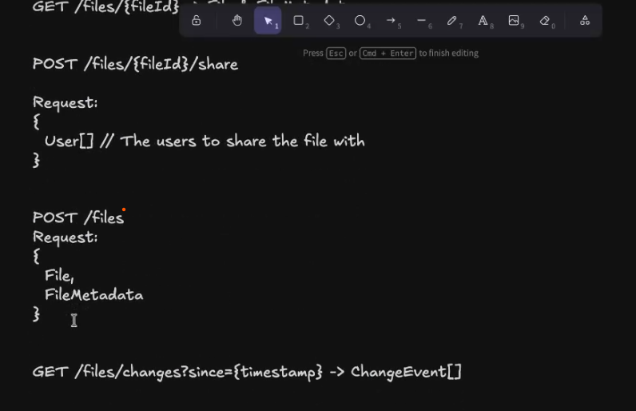
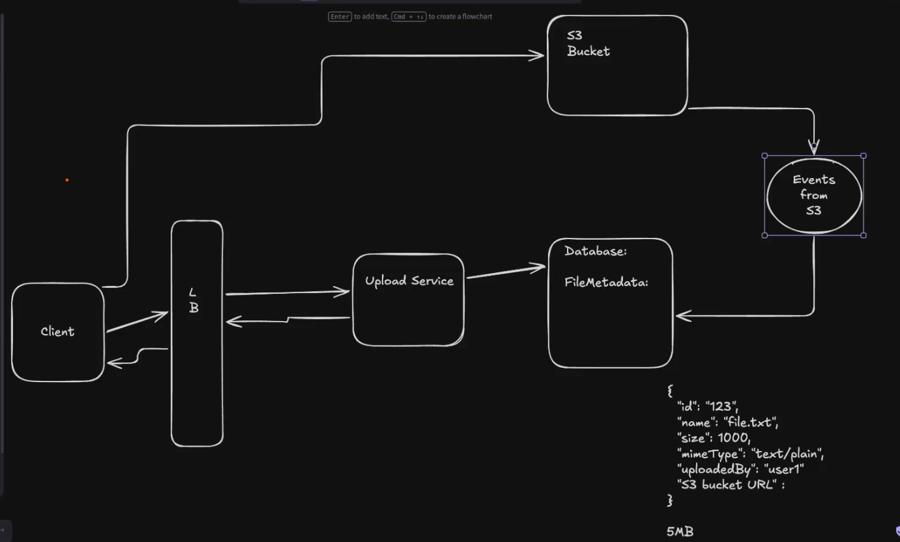
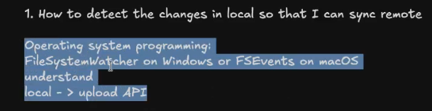

# Load balancing

## Hashing

## Load Balancing Consistent Hashing

# Proxies

## Forward proxy

## Reverse Proxy

# CAD THEOREM

# Design Google Drive

## Requirements
### Functional Requirements
- Users should be able to upload files, create folders, copy and move files & folder just like a filesystem.
- Users should be able to access their files from any device, as long as they're logged in to their accounts.

### No functional requirements
- Resumable upload.

### Schema
- File
- Folders
- FileMetadata

### API

### HLD

#### Upload File
Blobs as S3, and Azure Blob can create events and execute lambda or azure functions.

#### Share File
use a join tbale.

#### Download File

##### CDNS and its problem

#### Sync The Multiple Clients.

##### Server Sent Events SSE.

##### Push & Pull

### How to upload the file of size 100GB
- Dynamic Chunking
- Static Chunking

#### How to update the file

### File Compression

### How to encrypt the files.

# Content-Encoding Response Header, BR & GZIP

# Homework
Create a Podcast System, suscribers, notifications of podcast uploaded. take in consideration there are celebrities.

