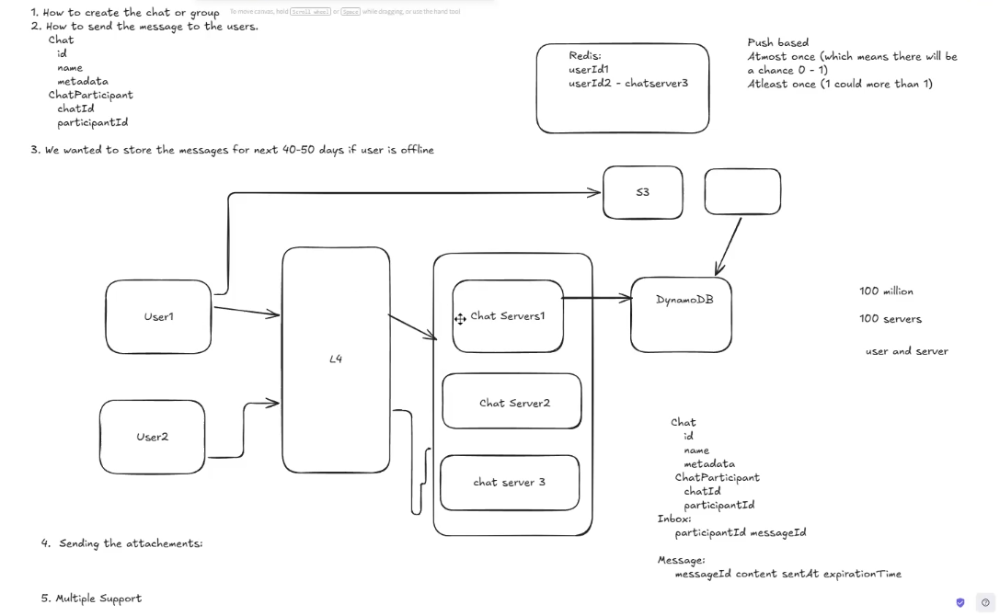
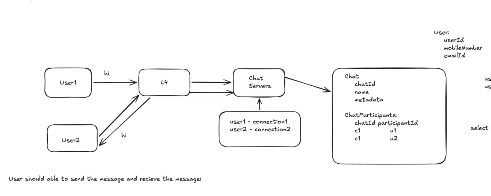

# Chatting Application

## Functional Requirements
- users can chat with one another.
- users messages are saved in a chat.
- users can block unwanted users to chat with them.
- users should have a contact list.

class:
1. Send and receive messages (text, video, images).
2. Group Messages.
3. Notifications.
4. User should be able to receive the messages if they are offline within 60 days of message being sent.
5. Support multiple clients (the same user can be logged in at different devices at any time).

## Non-Functional Requirements
1. Messages should be encrypted.
2. 

class:
1. Low latecy (<50ms)
2. Definitely needs to be available and consistent with respect to time.
3. Able to handle high throughput.
4. secure

Client request - resposne (latency)
througput - number of requests handled per second.

## Schema
- User
- Chat, ChatParticipant
- Messages
- Clients

## API
Websocket driven.

Create the chat:
{
    participants: [],
    name: 
} ->
{
    chatId
}

Send Message (triggers an event)
{
    chatId
    message
    attachments: []
} ->
{
    status (Failure|Success|InProgress)
    messageId
}

Adding or removing a participants in the chat.

Remark: a chat is a group with only two participants.

## High Level Design

The load balancer needs to be L4. Because L7 loadbalancers can't offer long connections because of networking mechanisms.

### How to create the chat

### How to send the message and receive the message.

## How to handle N to N queries, select * from ChatParticipants where participantid = loggedinUser

DynamoDb (Key-Value database)
- Partition Key
- Sort Key
- Global Secondary Index

### How to send messages with attachments.

## Scaling the System

1. How many server socket connections can a server support.
[article](https://www.phoenixframework.org/blog/the-road-to-2-million-websocket-connections)

In linux, connections are just file descriptors.

The limit is the mas size fd table a process can have.

2. How to send messages to recipients who are connected to different servers?

Redis Pub Sub

3. How to support multiple clients?

5. how to ensure order of messages?
why is the sequence number per participant, instead of per chat?
there's a sequence number per chat, but we also need to persist at what sequence number a participant is at.

6. How to implement last-seen functionality

# Miscalleneous

## DYNAMODB

## When to use L7 over L4.
L7 whenver you have multiple microservices involved routing on the basis of endpoints.

my view:
"
yes as in this case there's nothing useful in the application layer to use a distribution criteria forr.
"