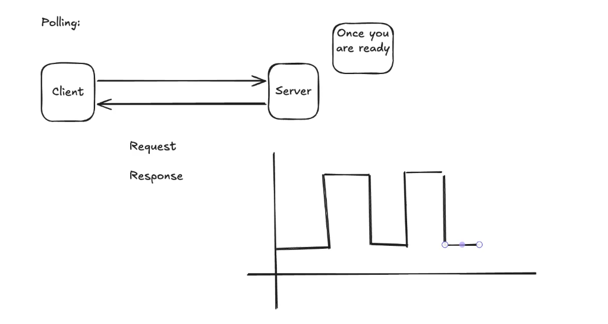

# Availability
Percent of time a system is available to use.
Why can't we achieve 100% availability?

if in one server out of 100 request 2 request fail then to achieve the availability of 99.9999 how many servers needed?

```
(1 - 0.02)^n >= 0.99999
solve for n.

logn both sides.

(1 - 0.02) >= logN(0.9999)
99.98
```

## Horizontal Scalibility
When increase your number system or server (hard to manage).

## Vertical Scaling
Configure the server resources.


# Reliability
How many times your system is correct - correctness.

Example:
An API is online and responds to every request, but sometimes charges users twice. That system is available, but not reliable.

Reliability cares about things like:

low failure rate
correct behavior
no data loss
no duplicated side effects
graceful recovery after failures

So reliability is about doing the right thing consistently over time.

# Consistency
For instance some users may see an outdate state of the system, and other will see a correct one.
Consistency means:

Do all users/nodes see the same correct data?

This matters especially in distributed systems with replication.

Example:
You transfer $100 from account A to account B.

A consistent system should not show:

Account A: -$100
Account B: still unchanged

At least not in a way that violates the system’s rules.

There are different levels of consistency:

Type	Meaning
Strong consistency	After a write, all reads see the latest value
Eventual consistency	Some reads may see old data, but replicas eventually catch up
Read-your-writes consistency	After you write something, you personally can read your own update

So consistency is about data correctness and agreement across the system.

# CAP Theorem

## Enventual Consistency


# Client to Server Communication

## REST (HTTP/HTTPS)

## Polling

### Client Side Timeouts
I think this has something to do with asp.net cancellation tokens.

## Server Sent Events

## WebSockets
Easier to implement than server sent events.

## gRPC


## Whats Next.
- UBER DESIGN (On driver's end). Uber for Driver.

- News Aggreated System

- Internal architecture redis.

- Partitions, databases.

- Databases types.